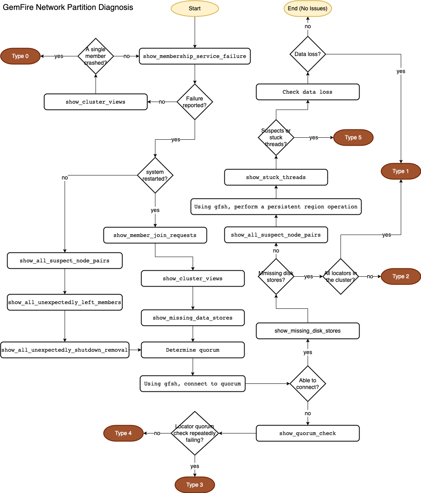

 [*PadoGrid*](https://github.com/padogrid) | [*Catalogs*](https://github.com/padogrid/catalog-bundles/blob/master/all-catalog.md) | [*Manual*](https://github.com/padogrid/padogrid/wiki) | [*FAQ*](https://github.com/padogrid/padogrid/wiki/faq) | [*Releases*](https://github.com/padogrid/padogrid/releases) | [*Templates*](https://github.com/padogrid/padogrid/wiki/Using-Bundle-Templates) | [*Pods*](https://github.com/padogrid/padogrid/wiki/Understanding-Padogrid-Pods) | [*Kubernetes*](https://github.com/padogrid/padogrid/wiki/Kubernetes) | [*Docker*](https://github.com/padogrid/padogrid/wiki/Docker) | [*Apps*](https://github.com/padogrid/padogrid/wiki/Apps) | [*Quick Start*](https://github.com/padogrid/padogrid/wiki/Quick-Start)

---
# Geode/GemFire Split-Brain

This bundle provides scripts, configuration files, and apps for creating a Geode/GemFire network split-brain environment where you can test Geode/GemFire split-brain capabilities.

## Table of Contents

- [Installing Bundle](#installing-bundle)
- [Use Case](#use-case)
- [Required Software](#required-software)
- [Bundle Contents](#bundle-contents)
- [Installation Steps](#installation-steps)
  - [1. Install Linux products](#1-install-linux-products)
  - [2. Install Geode or GemFire on host OS](#2-install-geode-or-gemfire-on-host-os)
  - [3. Create pod](#3-create-pod)
  - [4. Build pod](#4-build-pod)
- [Startup Sequence](#startup-sequence)
  - [1. Install `ntpd` to synchronize clocks](#1-install-ntpd-to-synchronize-clocks)
  - [2. Update `/etc/hosts`](#2-update-etchosts)
  - [3. Start Cluster](#3-start-cluster)
  - [4. Monitor Pulse](#4-monitor-pulse)
  - [5. Ingest data - `perf_test_sb`](#5-ingest-data---perf_test_sb)
- [Network Partition](#network-partition)
  - [GemFire Documentation](#gemfire-documentation)
  - [GemFire Network Partition Types](#gemfire-network-partition-types)
  - [Scripts](#scripts)
- [Test Cases](#test-cases)
  - [Type 0](#type-0)
    - [Type 0 - Merger](#type-0---merger)
    - [Type 0 Summary](#type-0-summary)
  - [Type 1](#type-1)
    - [Type 1 - Merger](#type-1---merger)
    - [Type 1 - Non-Merger](#type-1---non-merger)
    - [Type 1 Summary](#type-1-summary)
  - [Type 2](#type-2)
    - [Type 2 - Merger](#type-2---merger)
    - [Type 2 Summary](#type-2-summary)
  - [Type 3](#type-3)
    - [Type 3 - Merger](#type-3---merger)
    - [Type 3 Summary](#type-3-summary)
  - [Type 4](#type-4)
    - [Type 4 - Merger](#type-4---merger)
    - [Type 4 Summary](#type-4-summary)
  - [Type 5](#type-5)
    - [Type 5 - Merger](#type-5---merger)
    - [Type 5 Summary](#type-5-summary)
- [Test Results](#test-results)
- [GemFire Network Partition](#gemfire-network-partition)
  - [Diagnosis](#diagnosis)
  - [Prognosis](#prognosis)
  - [Recovery Guidelines](#recovery-guidelines)
    - [Type 0 Recovery Steps](#type-0-recovery-steps)
    - [Type 1 Recovery Steps](#type-1-recovery-steps)
    - [Type 2 Recovery Steps](#type-2-recovery-steps)
    - [Type 3 Recovery Steps](#type-3-recovery-steps)
    - [Type 4 Recovery Steps](#type-4-recovery-steps)
    - [Type 5 Recovery Steps](#type-5-recovery-steps)
- [Teardown](#Teardown)
  - [Stop Cluster](#stop-cluster)
  - [Stop Pod](#stop-pod)
  - [Remove Pod](#remove-pod)
- [References](#references)

## Installing Bundle

```console
install_bundle -download bundle-geode-1-app-perf_test_sb-cluster-sb
```

## Use Case

To prepare for encountering cluster split-brain situations, this use case provides step-by-step instructions for creating and diagnosing five (5) types of network parition covering all possibilities.

- [Type 0: Single data node isolated, locators unreachable.](#type-0)
- [Type 1: Data nodes isolated, locators unreachable.](#type-1)
- [Type 2: Locators divided.](#type-2)
- [Type 3: Quorum without locators.](#type-3)
- [Type 4: Locators isolated, data nodes unreachable.](#type-4)
- [Type 5: Data nodes isolated, locators reachable.](#type-5)

The following diagram shows Network Partition Type 2.


## Required Software

- [Vagrant](https://www.vagrantup.com/downloads) (1)
- [VirtualBox](https://www.virtualbox.org/) (1)
- [Geode](https://archive.apache.org/dist/geode/) or [GemFire](https://network.pivotal.io/products/pivotal-gemfire) (2)
- [Linux JDK](https://www.oracle.com/java/technologies/javase-downloads.html) (2)

1. This bundle uses PadoGrid pods which require Vagrant and VirtualBox. If you have not installed them, then please download and install them now by following the links above. For details on PadoGrid pods, see [Understanding PadoGrid Pods](https://github.com/padogrid/padogrid/wiki/Understanding-Padogrid-Pods).
2. We need Geode or GemFire and JDK for Linux in the VirtualBox VMs. We will install them later.

## Bundle Contents

```console
apps
└── perf_test_sb

clusters
└── sb
```

This bundle includes the following components.

- Cluster **sb**. The sb cluster is configured with five (5) VM members running in the `pod_sb` pod. It includes scripts that use `iptables` to drop TCP packets to split the `sb` cluster into two (2). It also includes scripts that scrape log files to display condensed timelines of key events.

- App **perf_test_sb**. The `perf_test_sb` app is configured to run on a split cluster.

*Note that the `sb` cluster is configured to run in the `pod_sb` pod with its members running as VM hosts and not Vagrant pod hosts.*

## Installation Steps

We will be taking the following steps as we setup and run the environment.

1. Install Linux products
2. Install Geode or GemFire on host OS
3. Create pod
4. Build pod

Follow the instructions in the subsequent sections.

### 1. Install Linux products

We need the following products installed before wen can setup Vagrant VMs. Download their tarball distributions by following the links.

- [Geode](https://archive.apache.org/dist/geode/) or [GemFire](https://network.pivotal.io/products/pivotal-gemfire)
- [Linux JDK](https://www.oracle.com/java/technologies/javase-downloads.html)

Assuming you have installed PadoGrid in the default directory, untar the downloaded tarballs in the `~/Padogrid/products/linux` directory as shown in the example below. If you have installed PadoGrid in a different directory, then make the appriate changes.

```bash
mkdir ~/Padogrid/products/linux
tar -C ~/Padogrid/products/linux -xzf  ~/Downloads/jdk-8u333-linux-x64.tar.gz
# Geode
tar -C ~/Padogrid/products/linux -xzf  ~/Downloads/apache-geode-1.14.4.tgz
# GemFire
tar -C ~/Padogrid/products/linux -xzf  ~/Downloads/pivotal-gemfire-9.10.16.tgz
```

Inflating the tarballs creates the following directories.

| Software for VMs | Host OS Path                                      |
| ---------------- | ------------------------------------------------- |
| JDK              | ~/Padogrid/products/linux/jdk-8u333-linux-x64     |
| Geode            | ~/Padogrid/products/linux/apache-geode-1.14.4     |
| GemFire          | ~/Padogrid/products/linux/pivotal-gemfire-9.10.16 |

### 2. Install Geode or GemFire on host OS

:pencil2: *In the previous section, we have installed software for the Vagrant VMs. If your host OS is Linux then you can use the same software by specifying the same directories.*

By default, PadoGrid installs all the products the `~/Padogrid/product` directory. If you have not installed Geode in that directory, then do so now by running the following commands.

```bash
# Install Geode on Host OS if not already installed
tar -C ~/Padogrid/products ~/Downloads/apache-geode-1.14.4.tgz
update_product -product geode

# Install GemFire on Host OS if not alrady installed
tar -C ~/Padogrid/products ~/Downloads/pivotal-gemfire-9.10.16.tgz
update_product -product gemfire
```

The `create_workspace` command shown below assumes the following proucts installed.

| Software for Host OS | Host OS Path                                  |
| ---------------------| --------------------------------------------- |
| Geode                | `~/Padogrid/products/apache-geode-1.14.4`     |
| GemFire              | `~/Padogrid/products/pivotal-gemfire-9.10.16` |
| PadoGrid             | `~/Padogrid/products/padogrid_0.9.20`         |

### 3. Create pod

Create a pod named `pod_sb` with seven (7) nodes. The pod name must be `pod_sb` since the included cluster, `sb`, has been paired with that pod name. Each VM should have at least 1024 MiB of memory.

```bash
# Directory specified by '-dir' is the host OS directory where the JDK and IMDG are installed.
# Configure 1536 MiB for primary and data nodes. Enable Avahi to allow hostname lookup of
# *.local hostnames via mDNS, i.e., pnode.local, node-01.local, etc.
create_pod -quiet \
  -avahi \
  -pod pod_sb \
  -pm 1536 \
  -nm 1536 \
  -count 7 \
  -dir /Users/dpark/Padogrid/products/linux
```

### 4. Build pod

Build the pod you just created.
 
```console
# Build and start the pod
build_pod -pod pod_sb
```

### 4.1. Cluster Configuration

The `sb` cluster has been preconfigured as follows. Plese see `etc/cluster.properties`

| Property         | Value                       |
| ---------------- | --------------------------- |
| pod.name         | pod_sb                      |
| locator.heap.max | 512m                        |
| heap.max         | 512m                        |
| vm.enabled       | true                        |
| vm.locator.hosts | node-06.local,node-07.local |
| vm.hosts         | node-01.local,node-02.local,node-03.local,node-04.local,node-05.local |

We have allocated seven (7) nodes: 2 for locators and 5 for data nodes. The primary node, `pnode.local`, is reserved for running scripts to split the network.

## Startup Sequence

### 1. Install `ntpd` to synchronize clocks

Login to `pnode.local` and run `install_ntpd` as follows.

```bash
# Login to pnode.local
ssh vagrant@pnode.local

# Install ntpd
switch_cluster sb/bin_sh
./install_ntpd
```

### 2. Update `/etc/hosts`

Due to Vagrant security restrictions, we need to edit each node's `/etc/hosts` and add a respective host name entry. The included `list_etc_host` script lists all the VM host names defined in the `etc/cluster.properties`.

From `pnode.local`, run `list_etc_hosts` as follows.

```bash
cd_cluster sb/bin_sh
./list_etc_hosts
```

Output:

```console
192.168.56.10 pnode pnode.local
192.168.56.11 node-01 node-01.local
192.168.56.12 node-02 node-02.local
192.168.56.13 node-03 node-03.local
192.168.56.14 node-04 node-04.local
192.168.56.15 node-05 node-05.local
192.168.56.16 node-06 node-06.local
192.168.56.17 node-07 node-07.local
```

Copy and paste the output in each host's `/etc/hosts` file. Make sure to comment out the `127.0.0.1` entry as shown in the example below.

```bash
ssh node-01.local
sudo vi /etc/hosts
```

Edit `/etc/hosts`:

```console
#127.0.1.1 node-01 node-01
192.168.56.10 pnode pnode.local
192.168.56.11 node-01 node-01.local
192.168.56.12 node-02 node-02.local
192.168.56.13 node-03 node-03.local
192.168.56.14 node-04 node-04.local
192.168.56.15 node-05 node-05.local
192.168.56.16 node-06 node-06.local
192.168.56.17 node-07 node-07.local
```

### 3. Start Cluster

From `pnode.local`, start the `sb` cluster as follows:

```console
# To make sure node-01 gets selected as the lead member, run 'start_cluster_lead_1' in 'bin_sh/'
switch_cluster sb/bin_sh
./start_cluster_lead_1

# Verify 2 locators and 5 members running
show_cluster
```

### 4. Monitor Pulse

Enter the following URL in your browser to monitor the cluster from the Geode Pulse.

[http://pnode.local:7070/pulse](http://pnode.local:7070/pulse)


### 5. Ingest data - `perf_test_sb`

From your host OS, build `perf_test_sb` and run `test_group` as follows:

```console
cd_app perf_test_sb; cd bin_sh
./build_app
./test_group -run
```

To check the region entry counts, run `test_group` as follows.

```bash
./test_group -list
```

Output:

```console
...
group: g1
  - name: replicate_persistent_overflow
    data: Region
    size: 10000
    cleared: false
  - name: partition_persistent
    data: Region
    size: 10000
    cleared: false
  - name: partition
    data: Region
    size: 10000
    cleared: false
  - name: replicate
    data: Region
    size: 10000
    cleared: false
  - name: replicate_persistent
    data: Region
    size: 10000
    cleared: false
  - name: partition_overflow
    data: Region
    size: 10000
    cleared: false
  - name: partition_persistent_overflow
    data: Region
    size: 10000
    cleared: false
  - name: replicate_overflow
    data: Region
    size: 10000
    cleared: false
...
```

## Network Partition

### GemFire Documentation

We closely follow the guidelines in the GemFire documentation on Network Partition.

- [How Network Partitioning Management Works](https://docs.vmware.com/en/VMware-Tanzu-GemFire/9.15/tgf/GUID-managing-network_partitioning-how_network_partitioning_management_works.html)
- [Failure Detection and Membership Views](https://docs.vmware.com/en/VMware-Tanzu-GemFire/9.15/tgf/GUID-managing-network_partitioning-failure_detection.html)
- [Membership Coordinators, Lead Members and Member Weighting](https://docs.vmware.com/en/VMware-Tanzu-GemFire/9.15/tgf/GUID-managing-network_partitioning-membership_coordinators_lead_members_and_weighting.html)
- [Log Messages and Solutions](https://docs.vmware.com/en/VMware-Tanzu-GemFire/9.15/tgf/GUID-managing-troubleshooting-log_messages_and_solutions.html?hWord=N4IghgNiBcIM4BcCuBjA1gAgQCwE4FMwATEAXyA)

### GemFire Network Partition Types

We carry out six (6) network partition scenarios using the included scripts. We refer each scenario by type so that we can quickly identify them. For each type, we split the network into two (2) and refer them as Split A and Split B.

**Type 0: Split A with one (1) node**

| Split | Weight   | VM Hosts                                                        |
| ----- | -------- | --------------------------------------------------------------- |
| A     | 15 (25%) | node-01 (lead)                                                  |
| B     | 46 (75%) | node-02, node-03, node-04, node-05, node-06, node-07 (locators) |

**Type 1: Split A without locators**

| Split | Weight   | VM Hosts                                                        |
| ----- | -------- | --------------------------------------------------------------- |
| A     | 25 (41%) | node-01 (lead), node-02                                         |
| B     | 36 (59%) | node-03, node-04, node-05, node-06, node-07 (locators)          |

**Type 2: Split A and B each with a locator**

| Split  | Weight   | VM Hosts                                                        |
| ------ | -------- | --------------------------------------------------------------- |
| A      | 28 (46%) | node-01 (lead), node-02, node-06 (locator)                      |
| B      | 33 (54%) | node-03, node-04, node-05, node-07 (locator)                    |

**Type 3: Split B quorum without locators**

| Split | Weight   | VM Hosts                                                        |
| ----- | -------- | --------------------------------------------------------------- |
| A     | 26 (43%) | node-01, node-02, node-06, node-07 (locators)                   |
| B     | 35 (57%) | node-03 (lead), node-04, node-05                                |

**Type 4: Split A with locators but without data nodes**

| Split | Weight   | VM Hosts                                                        |
| ----- | -------- | --------------------------------------------------------------- |
| A     | 6 (10%)  | node-06, node-07 (locators)                                     |
| B     | 55 (90%) | node-01 (lead), node-02, node-03, node-04, node-05              |


**Type 5: Split A and B with both locators**

| Split | Weight   | VM Hosts                                                        |
| ----- | -------- | --------------------------------------------------------------- |
| A     | 31 (51%) | node-01 (lead), node-02, node-06, node-07 (locators)            |
| B     | 36 (59%) | node-03, node-04, node-05, node-06, node-07 (locators)          |

### Regions

Before we split the network, we ingest data into eight (8) regions by running `test_group` as shown blow.

| Region                             | Data Policy (refid)                     |
| ---------------------------------- | --------------------------------------- |
| partition                          | PARTITION_REDUNDANT                     |
| partition_overflow                 | PARTITION_REDUNDANT_OVERFLOW            |
| partition_persistent               | PARTITION_REDUNDANT_PERSISTENT          |
| partition_persistent_overflow      | PARTITION_REDUNDANT_PERSISTENT_OVERFLOW |
| replicate                          | REPLICATE                               |
| replicate_overflow                 | REPLICATE_OVERFLOW                      |
| replicate_persistent               | REPLICATE_PERSISTENT                    |
| replicate_persistent_overflow      | REPLICATE_PERSISTENT_OVERFLOW           |

We expect persistent regions to recover data and non-persistent regions to lose data upon network recovery.

### Scripts

All test cases must be conducted on `pnode.local`. Login to `pnode.local` and switch cluster as follows.

```bash
# Login to pnode.local
ssh vagrant@pnode.local

# Switch to sb/bin_sh which contains network partitioning scripts
switch_cluster sb/bin_sh
```

The `sb/bin_sh` folder contains the following network partitioning scripts. The `-?` option displays the command usage.

| Script        | Description                                                           |
| ------------- | --------------------------------------------------------------------- |
| list_rules    | List all rules in iptables for all VM hosts (nodes) in the cluster sb |
| merge_cluster | Merge the split clusters by resetting iptables                        |
| split_cluster | Split the cluster sb into two (2)                                     |

The `sb/bin_sh` folder also contains log scraping scripts as follows. These scripts will help us analyzing the state of the cluster. The `-?` option displays the command usage.

| Script                                 | Description                                                                  |
| -------------------------------------- | ---------------------------------------------------------------------------- |
| show_all_suspect_node_pairs            | Find the specified suspect node from all log files                           |
| show_all_unexpectedly_left_members     | Display unexpectedly left members in chronological order                     |
| show_all_unexpectedly_shutdown_removal | Find the members that unexpectedly shutdown for removal from the cluster     |
| show_cluster_views                     | Display cluster views in chronological order                                 |
| show_member_join_requests              | Display member join requests received by the locators in chronological order |
| show_membership_service_failure        | Display membership service failure and restarted messages from locators      |
| show_missing_disk_stores               | Display missing disk stores                                                  |
| show_offline_members                   | Display offline regions per member                                           |
| show_stuck_threads                     | Find stuck threads                                                           |
| show_suspect_node_pair                 | Find the specified suspect node pair from the log files                      |

To display the `sb` cluster status, run the `show_cluster` command as follows.

```bash
show_cluster -long
```

Output:

```console
----------------------------------------------------------------
         CLUSTER: sb
     CLUSTER_DIR: /home/vagrant/rwe-bundles/bundle-geode-1-app-perf_test_sb-cluster-sb/clusters/sb
         PRODUCT: geode
      Deployment: VM

01       Locator: sb-locator-node-06-01
           STATE: Running
             PID: 13570
    LOCATOR_PORT: 10334
       PULSE_URL: http://node-06.local:7070/pulse
         JMX_URL: service:jmx:rmi:///jndi/rmi://node-06.local:12001/jmxrmi
     Working Dir: /home/vagrant/rwe-bundles/bundle-geode-1-app-perf_test_sb-cluster-sb/clusters/sb/run/sb-locator-node-06-01
        LOG_FILE: /home/vagrant/rwe-bundles/bundle-geode-1-app-perf_test_sb-cluster-sb/clusters/sb/log/sb-locator-node-06-01.log

02       Locator: sb-locator-node-07-01
           STATE: Running
             PID: 22968
    LOCATOR_PORT: 10334
       PULSE_URL: http://node-07.local:7070/pulse
         JMX_URL: service:jmx:rmi:///jndi/rmi://node-07.local:12001/jmxrmi
     Working Dir: /home/vagrant/rwe-bundles/bundle-geode-1-app-perf_test_sb-cluster-sb/clusters/sb/run/sb-locator-node-07-01
        LOG_FILE: /home/vagrant/rwe-bundles/bundle-geode-1-app-perf_test_sb-cluster-sb/clusters/sb/log/sb-locator-node-07-01.log

01        Member: sb-node-01
           STATE: Running
             PID: 26513
     MEMBER_PORT: 40404
 MEMBER_HTTP_URL: http://node-01.local:7080/geode/swagger-ui.html
      DEBUG_PORT: 9101
 PROMETHEUS_PORT: 8091
         JMX_URL: service:jmx:rmi:///jndi/rmi://node-01.local:12001/jmxrmi
     Working Dir: /home/vagrant/rwe-bundles/bundle-geode-1-app-perf_test_sb-cluster-sb/clusters/sb/run/sb-node-01
        LOG_FILE: /home/vagrant/rwe-bundles/bundle-geode-1-app-perf_test_sb-cluster-sb/clusters/sb/log/sb-node-01.log
...
```

We can see from the above output, the `sb` cluster has been configured as follows.

| Nodes    | VM Hosts                                                                 |
| -------- | ------------------------------------------------------------------------ |
| Locators | node-06.local, node-07.local                                             |
| Members  | node-01.local, node-02.local,node-03.local, node-04.local, node-05.local |

We are now ready to conduct split-brain tests. The subsequent section presents a test case per network partition type. Each test case can be carried out independently. In each test case, we restart the cluster in a clean state.

---

## Test Cases

### Type 0

**Single data node isloated, locators unreachable.** In this test case, we split the network with a single data node unreachable by locators. i.e., Split A with a single data node and Split B with locators, as shown below. 

Technically, this type does not represent a split-brain scenario. Since we have configured Geode/GemFire to store two (2) copies of data, if a single data node fails, Geode/GemFire will simply continue to serve the backup copy of data as if nothing happened. Nontheless, we include this type for completeness.

:pencil2: Note that if we have configured Geode/GemFire with a single copy of data, then a single data node failure leads to Type 1.

| Split | Weight   | VM Hosts                                                        |
| ----- | -------- | --------------------------------------------------------------- |
| A     | 15 (25%) | node-01 (lead)                                                  |
| B     | 46 (75%) | node-02, node-03, node-04, node-05, node-06, node-07 (locators) |


Restart the cluster and ingest data.

```bash
# Kill the cluster and clean all log and persistent files
kill_cluster -all
clean_cluster -all

# To make sure node-01 gets selected as the lead member, run 'start_cluster_lead_1' in 'bin_sh/'
cd_cluster sb/bin_sh
./start_cluster_lead_1

# Once the cluster is up, ingest data.
cd_app perf_test_sb/bin_sh
./test_group -run

# Check the entry count in each region we just ingested
./test_group -list
```

From `pnode.local`, run `split_cluster` as follows:

```console
switch_cluster sb/bin_sh
./split_cluster -type 0
```

Running `show_membership_service_failure` shows no failures.

```bash
./show_membership_service_failure
```

```console
Member service failure
----------------------
Now: 2022/08/11 16:41:20 UTC
```

Running `show_cluster_views` shows **node-01** has crashed.

```bash
./show_cluster_views
```

Ouptput:

```console
Received Views
--------------
sb-locator-node-06.log: 2022/08/11 16:33:24.444 UTC
└── 192.168.56.16(sb-locator-node-06:17462:locator)<ec><v0>:41000|0
    ├── 192.168.56.16(sb-locator-node-06:17462:locator)<ec><v0>:41000
sb-locator-node-06.log: 2022/08/11 16:33:24.774 UTC
└── 192.168.56.16(sb-locator-node-06:17462:locator)<ec><v0>:41000|1
    ├── 192.168.56.16(sb-locator-node-06:17462:locator)<ec><v0>:41000
    ├── 192.168.56.17(sb-locator-node-07:14864:locator)<ec><v1>:41000
sb-locator-node-06.log: 2022/08/11 16:34:41.478 UTC
└── 192.168.56.16(sb-locator-node-06:17462:locator)<ec><v0>:41000|2
    ├── 192.168.56.16(sb-locator-node-06:17462:locator)<ec><v0>:41000
    ├── 192.168.56.17(sb-locator-node-07:14864:locator)<ec><v1>:41000
    ├── 192.168.56.11(sb-node-01:14786)<v2>:41000{lead}
    ├── 192.168.56.14(sb-node-04:8813)<v2>:41000
    ├── 192.168.56.13(sb-node-03:9180)<v2>:41000
    ├── 192.168.56.15(sb-node-05:9652)<v2>:41000
    ├── 192.168.56.12(sb-node-02:10403)<v2>:41000
sb-locator-node-06.log: 2022/08/11 16:37:43.901 UTC
└── 192.168.56.16(sb-locator-node-06:17462:locator)<ec><v0>:41000|3
    ├── 192.168.56.16(sb-locator-node-06:17462:locator)<ec><v0>:41000
    ├── 192.168.56.17(sb-locator-node-07:14864:locator)<ec><v1>:41000
    ├── 192.168.56.14(sb-node-04:8813)<v2>:41000{lead}
    ├── 192.168.56.13(sb-node-03:9180)<v2>:41000
    ├── 192.168.56.15(sb-node-05:9652)<v2>:41000
    ├── 192.168.56.12(sb-node-02:10403)<v2>:41000
    crashed:
    ├── 192.168.56.11(sb-node-01:14786)<v2>:41000
sb-locator-node-07.log: 2022/08/11 16:33:24.805 UTC
└── 192.168.56.16(sb-locator-node-06:17462:locator)<ec><v0>:41000|1
    ├── 192.168.56.16(sb-locator-node-06:17462:locator)<ec><v0>:41000
    ├── 192.168.56.17(sb-locator-node-07:14864:locator)<ec><v1>:41000
sb-locator-node-07.log: 2022/08/11 16:34:41.510 UTC
└── 192.168.56.16(sb-locator-node-06:17462:locator)<ec><v0>:41000|2
    ├── 192.168.56.16(sb-locator-node-06:17462:locator)<ec><v0>:41000
    ├── 192.168.56.17(sb-locator-node-07:14864:locator)<ec><v1>:41000
    ├── 192.168.56.11(sb-node-01:14786)<v2>:41000{lead}
    ├── 192.168.56.14(sb-node-04:8813)<v2>:41000
    ├── 192.168.56.13(sb-node-03:9180)<v2>:41000
    ├── 192.168.56.15(sb-node-05:9652)<v2>:41000
    ├── 192.168.56.12(sb-node-02:10403)<v2>:41000
sb-locator-node-07.log: 2022/08/11 16:37:43.924 UTC
└── 192.168.56.16(sb-locator-node-06:17462:locator)<ec><v0>:41000|3
    ├── 192.168.56.16(sb-locator-node-06:17462:locator)<ec><v0>:41000
    ├── 192.168.56.17(sb-locator-node-07:14864:locator)<ec><v1>:41000
    ├── 192.168.56.14(sb-node-04:8813)<v2>:41000{lead}
    ├── 192.168.56.13(sb-node-03:9180)<v2>:41000
    ├── 192.168.56.15(sb-node-05:9652)<v2>:41000
    ├── 192.168.56.12(sb-node-02:10403)<v2>:41000
    crashed:
    ├── 192.168.56.11(sb-node-01:14786)<v2>:41000
Now: 2022/08/11 16:40:40 UTC
```

Running `show_all_suspect_node_pairs` shows **node-07** is a suspect for **node-01**. We know from the previous step, **node-01** has crashed.

```bash
./show_all_suspect_node_pairs
```

```console
Suspect: node-01
---------------------------------------
Not found.

Suspect: node-02
---------------------------------------
Not found.

Suspect: node-03
---------------------------------------
Not found.

Suspect: node-04
---------------------------------------
Not found.

Suspect: node-05
---------------------------------------
Not found.

Suspect: node-06
---------------------------------------
Not found.

Suspect: node-07
---------------------------------------
For:
└── 192.168.56.11(sb-node-01:14786)

First logged:
2022/08/11 16:37:38.587 UTC
├──  log: sb-locator-node-06.log
├── from: 192.168.56.17(sb-locator-node-07:14864:locator)<ec><v1>:41000
├──  for: 192.168.56.11(sb-node-01:14786)<v2>:41000
└──  msg: Member isn't responding to heartbeat requests

Last logged:
2022-08-11 16:37:38
├──  log: sb-node-05.log
├── from: 192.168.56.17(sb-locator-node-07:14864:locator)<ec><v1>:41000
├──  for: 192.168.56.11(sb-node-01:14786)<v2>:41000
└──  msg: Member isn't responding to heartbeat requests

Suspect: myself
---------------------------------------
For:
└── 192.168.56.11(sb-node-01:14786)

First logged:
2022/08/11 16:37:38.602 UTC
├──  log: sb-locator-node-07.log
├── from: myself
├──  for: 192.168.56.11(sb-node-01:14786)<v2>:41000
└──  msg: Member isn't responding to heartbeat requests

Last logged:
2022/08/11 16:37:38.602 UTC
├──  log: sb-locator-node-07.log
├── from: myself
├──  for: 192.168.56.11(sb-node-01:14786)<v2>:41000
└──  msg: Member isn't responding to heartbeat requests

Now: 2022/08/11 16:42:09 UTC
```

```bash
./show_all_unexpectedly_left_members
```

Output:

```console
Member unexpectedly left:
-------------------------
sb-locator-node-06.log
├── 2022/08/11 16:37:43.908 UTC
│   └──  192.168.56.11(sb-node-01:14786)<v2>:41000
sb-locator-node-07.log
├── 2022/08/11 16:37:43.934 UTC
│   └──  192.168.56.11(sb-node-01:14786)<v2>:41000
sb-node-02.log
├── 2022-08-11 16:37:43
│   └──  192.168.56.11(sb-node-01:14786)<v2>:41000
sb-node-03.log
├── 2022-08-11 16:37:43
│   └──  192.168.56.11(sb-node-01:14786)<v2>:41000
sb-node-04.log
├── 2022-08-11 16:37:43
│   └──  192.168.56.11(sb-node-01:14786)<v2>:41000
sb-node-05.log
├── 2022-08-11 16:37:43
│   └──  192.168.56.11(sb-node-01:14786)<v2>:41000
Now: 2022/08/11 16:43:50 UTC
```

Running `test_group -list` shows all the regions have the correct entry counts.

```bash
cd_app perf_test_sb/bin_sh
./test_group -list
```

```console
...
group: g1
  - name: partition_persistent_overflow
    data: Region
    size: 10000
    cleared: false
  - name: replicate_overflow
    data: Region
    size: 10000
    cleared: false
  - name: partition_persistent
    data: Region
    size: 10000
    cleared: false
  - name: partition
    data: Region
    size: 10000
    cleared: false
  - name: partition_overflow
    data: Region
    size: 10000
    cleared: false
  - name: replicate_persistent_overflow
    data: Region
    size: 10000
    cleared: false
  - name: replicate
    data: Region
    size: 10000
    cleared: false
  - name: replicate_persistent
    data: Region
    size: 10000
    cleared: false
...
```

#### Type 0 - Merger

Let's now merge Split A and Split B by running `merge_cluster`.

```bash
./merge_cluster
```

Running `./show_member_join_requests` does not show a join request from **node-01**.

```bash
./show_member_join_requests
```

Output:

```console
Member join requests:
---------------------
sb-locator-node-06.log
├── 2022/08/11 16:33:23.671 UTC
│   └── 192.168.56.17(sb-locator-node-07:14864:locator)<ec>:41000
├── 2022/08/11 16:34:41.170 UTC
│   └── 192.168.56.11(sb-node-01:14786):41000
├── 2022/08/11 16:34:41.175 UTC
│   └── 192.168.56.14(sb-node-04:8813):41000
├── 2022/08/11 16:34:41.199 UTC
│   └── 192.168.56.13(sb-node-03:9180):41000
├── 2022/08/11 16:34:41.218 UTC
│   └── 192.168.56.15(sb-node-05:9652):41000
├── 2022/08/11 16:34:41.234 UTC
│   └── 192.168.56.12(sb-node-02:10403):41000
Now: 2022/08/11 16:42:53 UTC
```

We now check the **node-01** log file for its status. It is repeatedly sending join requests but it is not receving responses. You can also look at the locator log files to see if they are logging **node-01** join requests but you will find nothing pertaining to **node-01** requests.

```bash
show_log -num 1
```

Output:

```console
...
2022-08-11 16:47:44 INFO  Services:330 - Discovery state after looking for membership coordinator is locatorsContacted=2; findInViewResponses=0; alreadyTried=[192.168.56.16(sb-locator-node-06:17462:locator)<ec><v0>:41000]; registrants=[192.168.56.11(sb-node-01:14786):41000, 192.168.56.11(sb-node-01:14786):41000, 192.168.56.11(sb-node-01:14786):41000, 192.168.56.11(sb-node-01:14786):41000, 192.168.56.11(sb-node-01:14786):41000]; possibleCoordinator=192.168.56.16(sb-locator-node-06:17462:locator)<ec><v0>:41000; viewId=3; hasContactedAJoinedLocator=true; view=View[192.168.56.16(sb-locator-node-06:17462:locator)<ec><v0>:41000|3] members: [192.168.56.16(sb-locator-node-06:17462:locator)<ec><v0>:41000, 192.168.56.17(sb-locator-node-07:14864:locator)<ec><v1>:41000, 192.168.56.14(sb-node-04:8813)<v2>:41000{lead}, 192.168.56.13(sb-node-03:9180)<v2>:41000, 192.168.56.15(sb-node-05:9652)<v2>:41000, 192.168.56.12(sb-node-02:10403)<v2>:41000]  crashed: [192.168.56.11(sb-node-01:14786)<v2>:41000]; responses=[]
2022-08-11 16:47:44 INFO  Services:333 - found possible coordinator 192.168.56.16(sb-locator-node-06:17462:locator)<ec><v0>:41000
2022-08-11 16:47:44 INFO  Services:431 - Probable coordinator is still 192.168.56.16(sb-locator-node-06:17462:locator)<ec><v0>:41000 - waiting for a join-response
2022-08-11 16:47:56 INFO  Services:287 - Stopping membership services
2022-08-11 16:47:56 INFO  Services:733 - GMSHealthMonitor server thread exiting
2022-08-11 16:47:56 WARN  InternalDistributedSystem:2616 - Caught SystemConnectException in reconnect
org.apache.geode.SystemConnectException: Unable to join the distributed system in 60400ms
	at org.apache.geode.distributed.internal.DistributionImpl.start(DistributionImpl.java:184) ~[geode-core-9.10.13.jar:?]
	at org.apache.geode.distributed.internal.DistributionImpl.createDistribution(DistributionImpl.java:220) ~[geode-core-9.10.13.jar:?]
	at org.apache.geode.distributed.internal.ClusterDistributionManager.<init>(ClusterDistributionManager.java:464) ~[geode-core-9.10.13.jar:?]
	at org.apache.geode.distributed.internal.ClusterDistributionManager.<init>(ClusterDistributionManager.java:497) ~[geode-core-9.10.13.jar:?]
	at org.apache.geode.distributed.internal.ClusterDistributionManager.create(ClusterDistributionManager.java:326) ~[geode-core-9.10.13.jar:?]
	at org.apache.geode.distributed.internal.InternalDistributedSystem.initialize(InternalDistributedSystem.java:756) ~[geode-core-9.10.13.jar:?]
	at org.apache.geode.distributed.internal.InternalDistributedSystem.access$200(InternalDistributedSystem.java:132) ~[geode-core-9.10.13.jar:?]
	at org.apache.geode.distributed.internal.InternalDistributedSystem$Builder.build(InternalDistributedSystem.java:3013) ~[geode-core-9.10.13.jar:?]
	at org.apache.geode.distributed.internal.InternalDistributedSystem.connectInternal(InternalDistributedSystem.java:282) ~[geode-core-9.10.13.jar:?]
	at org.apache.geode.distributed.internal.InternalDistributedSystem.reconnect(InternalDistributedSystem.java:2584) ~[geode-core-9.10.13.jar:?]
	at org.apache.geode.distributed.internal.InternalDistributedSystem.tryReconnect(InternalDistributedSystem.java:2403) ~[geode-core-9.10.13.jar:?]
	at org.apache.geode.distributed.internal.InternalDistributedSystem.disconnect(InternalDistributedSystem.java:1255) ~[geode-core-9.10.13.jar:?]
	at org.apache.geode.distributed.internal.ClusterDistributionManager$DMListener.membershipFailure(ClusterDistributionManager.java:2323) ~[geode-core-9.10.13.jar:?]
	at org.apache.geode.distributed.internal.membership.gms.GMSMembership.uncleanShutdown(GMSMembership.java:1296) ~[geode-membership-9.10.13.jar:?]
	at org.apache.geode.distributed.internal.membership.gms.GMSMembership$ManagerImpl.lambda$forceDisconnect$0(GMSMembership.java:2039) ~[geode-membership-9.10.13.jar:?]
	at java.lang.Thread.run(Thread.java:750) [?:1.8.0_333]
2022-08-11 16:47:56 INFO  InternalDistributedSystem:2537 - Disconnecting old DistributedSystem to prepare for a reconnect attempt
```

Since we have not lost data, we can safely restart **node-01** as follows.

```bash
stop_member -num 1
show_cluster
start_member -num 1
```

Running `./show_member_join_requests` shows **node-01** is now able to rejoin the cluster.

```bash
./show_member_join_requests
```

Output:

```console
Member join requests:
---------------------
sb-locator-node-06.log
├── 2022/08/11 16:33:23.671 UTC
│   └── 192.168.56.17(sb-locator-node-07:14864:locator)<ec>:41000
├── 2022/08/11 16:34:41.170 UTC
│   └── 192.168.56.11(sb-node-01:14786):41000
├── 2022/08/11 16:34:41.175 UTC
│   └── 192.168.56.14(sb-node-04:8813):41000
├── 2022/08/11 16:34:41.199 UTC
│   └── 192.168.56.13(sb-node-03:9180):41000
├── 2022/08/11 16:34:41.218 UTC
│   └── 192.168.56.15(sb-node-05:9652):41000
├── 2022/08/11 16:34:41.234 UTC
│   └── 192.168.56.12(sb-node-02:10403):41000
├── 2022/08/11 16:58:30.237 UTC
│   └── 192.168.56.11(sb-node-01:16784):41000
Now: 2022/08/11 17:01:37 UTC
```

`gfsh` also shows **node-01** in the cluster.

```bash
gfsh>list members
Member Count : 7

       Name        | Id
------------------ | ---------------------------------------------------------------------------
sb-node-01         | 192.168.56.11(sb-node-01:16784)<v4>:41000
sb-node-02         | 192.168.56.12(sb-node-02:10403)<v2>:41000
sb-node-03         | 192.168.56.13(sb-node-03:9180)<v2>:41000
sb-node-04         | 192.168.56.14(sb-node-04:8813)<v2>:41000
sb-node-05         | 192.168.56.15(sb-node-05:9652)<v2>:41000
sb-locator-node-06 | 192.168.56.16(sb-locator-node-06:17462:locator)<ec><v0>:41000 [Coordinator]
sb-locator-node-07 | 192.168.56.17(sb-locator-node-07:14864:locator)<ec><v1>:41000
```

#### Type 0 Summary

- This test case split the network to isolate one (1) member (in Split A) from reaching the locators and the remaining members.
- We found that the coordinator quickly detects the unreachable member.
- We saw no data loss and the cluster continues to run without any problems.
- When we merged the splits, we saw the isolated member repeatedly sending join requests to the coordinator, but they are ignored. The isolated member is not able to rejoin the cluster.
- We had to restart the isolated member for it to rejoined the cluster.

---

### Type 1

**Data nodes isloated, locators unreachable.** In this test case, we split the network with some data nodes unreachable by locators. i.e., Split A without locators and Split B with locators, as shown below.

| Split | Weight   | VM Hosts                                               |
| ----- | -------- | ------------------------------------------------------ |
| A     | 25 (41%) | node-01 (lead), node-02                                |
| B     | 36 (59%) | node-03, node-04, node-05, node-06, node-07 (locators) |


Restart the cluster and ingest data.

```bash
# Kill the cluster and clean all log and persistent files
kill_cluster -all
clean_cluster -all

# To make sure node-01 gets selected as the lead member, run 'start_cluster_lead_1' in 'bin_sh/'
cd_cluster sb/bin_sh
./start_cluster_lead_1

# Once the cluster is up, ingest data.
cd_app perf_test_sb/bin_sh
./test_group -run

# Check the entry count in each region we just ingested
./test_group -list
```

From `pnode.local`, run `split_cluster` as follows:

```console
switch_cluster sb/bin_sh
./split_cluster -type 1
```

To see the `iptables` rules set by `split_cluster`, run `list_rules` as follows:

```console
./list_rules
```

Output:

```console
...
node-01.local
-------------
Chain INPUT (policy ACCEPT)
target     prot opt source               destination
DROP       all  --  192.168.56.14        anywhere
DROP       all  --  192.168.56.15        anywhere
DROP       all  --  192.168.56.16        anywhere
DROP       all  --  192.168.56.17        anywhere

Chain FORWARD (policy ACCEPT)
target     prot opt source               destination

Chain OUTPUT (policy ACCEPT)
target     prot opt source               destination

node-02.local
-------------
Chain INPUT (policy ACCEPT)
target     prot opt source               destination
DROP       all  --  192.168.56.14        anywhere
DROP       all  --  192.168.56.15        anywhere
DROP       all  --  192.168.56.16        anywhere
DROP       all  --  192.168.56.17        anywhere
...
```

From `pnode.local`, monitor the log files to see the cluster being split into two (2). The `show_cluster_views` scrapes the log files to build a complete timeline of the cluster views.

```bash
./show_cluster_views -long
```

Output:

```console
...
sb-locator-node-07-01.log:[info 2022/07/18 23:25:54.892 UTC sb-locator-node-07-01 <unicast receiver,node-07-45188> tid=0x1e]
└── 192.168.56.16(sb-locator-node-06-01:3588:locator)<ec><v0>:41000|2
    ├── 192.168.56.16(sb-locator-node-06-01:3588:locator)<ec><v0>:41000,
    ├── 192.168.56.17(sb-locator-node-07-01:8554:locator)<ec><v1>:41000,
    ├── 192.168.56.14(sb-node-04:5707)<v2>:41000{lead},
    ├── 192.168.56.12(sb-node-02:9901)<v2>:41000,
    ├── 192.168.56.13(sb-node-03:5278)<v2>:41000,
    ├── 192.168.56.15(sb-node-05:5940)<v2>:41000,
    └── 192.168.56.11(sb-node-01:21411)<v2>:41000
```

To see the suspect nodes that are not responding, we can run `show_all_suspect_node_pairs`, which displays the last log messages of the suspects.

```bash
./show_all_suspect_node_pairs
```

Output:

```console
Suspect: node-01
---------------------------------------
Not found.

Suspect: node-02
---------------------------------------
For:
192.168.56.13(sb-node-03:26954)
192.168.56.14(sb-node-04:27432)
192.168.56.15(sb-node-05:27669)
192.168.56.16(sb-locator-node-06-01:27290:locator)
192.168.56.17(sb-locator-node-07-01:31149:locator)

First logged:
sb-locator-node-06-01.log:[info 2022/07/23 17:52:50.288 UTC sb-locator-node-06-01 <unicast receiver,node-06-18485> tid=0x1e] received suspect message from 192.168.56.12(sb-node-02:32593)<v2>:41000 for 192.168.56.13(sb-node-03:26954)<v2>:41000: Member isn't responding to heartbeat requests
sb-locator-node-06-01.log:[info 2022/07/23 17:52:52.745 UTC sb-locator-node-06-01 <unicast receiver,node-06-18485> tid=0x1e] received suspect message from 192.168.56.12(sb-node-02:32593)<v2>:41000 for 192.168.56.15(sb-node-05:27669)<v2>:41000: Member isn't responding to heartbeat requests
sb-locator-node-06-01.log:[info 2022/07/23 17:52:55.273 UTC sb-locator-node-06-01 <unicast receiver,node-06-18485> tid=0x1e] received suspect message from 192.168.56.12(sb-node-02:32593)<v2>:41000 for 192.168.56.14(sb-node-04:27432)<v2>:41000: Member isn't responding to heartbeat requests
sb-locator-node-06-01.log:[info 2022/07/23 17:53:02.746 UTC sb-locator-node-06-01 <unicast receiver,node-06-18485> tid=0x1e] received suspect message from 192.168.56.12(sb-node-02:32593)<v2>:41000 for 192.168.56.16(sb-locator-node-06-01:27290:locator)<ec><v0>:41000: Member isn't responding to heartbeat requests
sb-locator-node-06-01.log:[info 2022/07/23 17:53:10.247 UTC sb-locator-node-06-01 <unicast receiver,node-06-18485> tid=0x1e] received suspect message from 192.168.56.12(sb-node-02:32593)<v2>:41000 for 192.168.56.17(sb-locator-node-07-01:31149:locator)<ec><v1>:41000: Member isn't responding to heartbeat requests

Last logged:
sb-node-05.log:2022-07-23 17:52:50 INFO  Services:1196 - received suspect message from 192.168.56.12(sb-node-02:32593)<v2>:41000 for 192.168.56.13(sb-node-03:26954)<v2>:41000: Member isn't responding to heartbeat requests
sb-node-05.log:2022-07-23 17:52:57 INFO  Services:1196 - received suspect message from 192.168.56.12(sb-node-02:32593)<v2>:41000 for 192.168.56.15(sb-node-05:27669)<v2>:41000: Member isn't responding to heartbeat requests
sb-node-05.log:2022-07-23 17:53:00 INFO  Services:1196 - received suspect message from 192.168.56.12(sb-node-02:32593)<v2>:41000 for 192.168.56.14(sb-node-04:27432)<v2>:41000: Member isn't responding to heartbeat requests
sb-node-05.log:2022-07-23 17:53:07 INFO  Services:1196 - received suspect message from 192.168.56.12(sb-node-02:32593)<v2>:41000 for 192.168.56.16(sb-locator-node-06-01:27290:locator)<ec><v0>:41000: Member isn't responding to heartbeat requests
sb-node-05.log:2022-07-23 17:53:15 INFO  Services:1196 - received suspect message from 192.168.56.12(sb-node-02:32593)<v2>:41000 for 192.168.56.17(sb-locator-node-07-01:31149:locator)<ec><v1>:41000: Member isn't responding to heartbeat requests

Suspect: node-03
---------------------------------------
Not found.

Suspect: node-04
---------------------------------------
Not found.

Suspect: node-05
---------------------------------------
Not found.

Suspect: node-06
---------------------------------------
Not found.

Suspect: node-07
---------------------------------------
Not found.
```

You can seee from the above output that **node-01** and **node-02** are suspects. They are not responding to the remaining data nodes and locators. You can also see Pulse getting inundated with the "Member Suspected" messages.


After a few minutes, the locators log "Membership service failure" and proceed to restart themselves. You can monitor these messages by running `show_membership_service_failure`.

The output below shows that the locator on **node-06** detects the network partition in 26 seconds. It logged the network partition message at `17:53:16.569` and the first suspect message was logged at `17:52:50.288` as shown in the previous ouput.

```bash
./show_membership_service_failure
```

Output:

```console
Member service failure
──────────────────────
sb-locator-node-06-01.log
├── [fatal 2022/07/23 17:53:16.569 UTC
│   └── Membership service failure: Exiting due to possible network partition event due to loss of 4 cache processes:
│       ├── 192.168.56.17(sb-locator-node-07-01:31149:locator)<ec><v1>:41000,
│       ├── 192.168.56.13(sb-node-03:26954)<v2>:41000,
│       ├── 192.168.56.14(sb-node-04:27432)<v2>:41000,
│       ├── 192.168.56.15(sb-node-05:27669)<v2>:41000
├── 2022/07/23 17:55:49.779 UTC
│   └── system restarted
sb-locator-node-07-01.log
├── [fatal 2022/07/23 17:53:15.390 UTC
│   └── Membership service failure: Member isn't responding to heartbeat requests
├── 2022/07/23 17:55:50.205 UTC
│   └── system restarted
```

When the locators restart, the locators publish the new cluster view. We can see a complete timeline of cluster views by running `show_cluster_views` as shown below. The output indicates that the cluster view has changed from five (5) data nodes at `2022/07/23 17:50:45.721 UTC` to three (3) at `2022/07/23 17:55:34.231 UTC`. It took 4:49 minutes to resolve the network partition.

We can also see from the above output, that most of the time is spent restarting the system. The locator on **node-01** detects a network partition at `17:53:16.569` and logs "system restarted" at `17:55:49.779`. It took 2:33 minutes to restart the entire system (or cluster).

```bash
./show_cluster_views -long
```

Output:

```console
sb-locator-node-06-01.log:[info 2022/07/23 17:49:30.893 UTC sb-locator-node-06-01 <main> tid=0x1]
└── 192.168.56.16(sb-locator-node-06-01:27290:locator)<ec><v0>:41000|0
    └── 192.168.56.16(sb-locator-node-06-01:27290:locator)<ec><v0>:41000
sb-locator-node-06-01.log:[info 2022/07/23 17:49:32.154 UTC sb-locator-node-06-01 <Geode Membership View Creator> tid=0x25]
└── 192.168.56.16(sb-locator-node-06-01:27290:locator)<ec><v0>:41000|1
    ├── 192.168.56.16(sb-locator-node-06-01:27290:locator)<ec><v0>:41000,
    └── 192.168.56.17(sb-locator-node-07-01:31149:locator)<ec><v1>:41000
sb-locator-node-06-01.log:[info 2022/07/23 17:50:45.567 UTC sb-locator-node-06-01 <Geode Membership View Creator> tid=0x25]
└── 192.168.56.16(sb-locator-node-06-01:27290:locator)<ec><v0>:41000|2
    ├── 192.168.56.16(sb-locator-node-06-01:27290:locator)<ec><v0>:41000,
    ├── 192.168.56.17(sb-locator-node-07-01:31149:locator)<ec><v1>:41000,
    ├── 192.168.56.11(sb-node-01:12242)<v2>:41000{lead},
    ├── 192.168.56.12(sb-node-02:32593)<v2>:41000,
    ├── 192.168.56.13(sb-node-03:26954)<v2>:41000,
    ├── 192.168.56.15(sb-node-05:27669)<v2>:41000,
    └── 192.168.56.14(sb-node-04:27432)<v2>:41000
sb-locator-node-06-01.log:[info 2022/07/23 17:55:33.803 UTC sb-locator-node-06-01 <ReconnectThread> tid=0xa3]
└── 192.168.56.16(sb-locator-node-06-01:27290:locator)<ec><v0>:41000|0
    └── 192.168.56.16(sb-locator-node-06-01:27290:locator)<ec><v0>:41000
sb-locator-node-06-01.log:[info 2022/07/23 17:55:34.114 UTC sb-locator-node-06-01 <Geode Membership View Creator> tid=0xba]
└── 192.168.56.16(sb-locator-node-06-01:27290:locator)<ec><v0>:41000|1
    ├── 192.168.56.16(sb-locator-node-06-01:27290:locator)<ec><v0>:41000,
    ├── 192.168.56.13(sb-node-03:26954)<v1>:41000{lead},
    ├── 192.168.56.15(sb-node-05:27669)<v1>:41000,
    ├── 192.168.56.14(sb-node-04:27432)<v1>:41000,
    └── 192.168.56.17(sb-locator-node-07-01:31149:locator)<ec><v1>:41000
sb-locator-node-07-01.log:[info 2022/07/23 17:49:32.271 UTC sb-locator-node-07-01 <unicast receiver,node-07-3671> tid=0x1e]
└── 192.168.56.16(sb-locator-node-06-01:27290:locator)<ec><v0>:41000|1
    ├── 192.168.56.16(sb-locator-node-06-01:27290:locator)<ec><v0>:41000,
    └── 192.168.56.17(sb-locator-node-07-01:31149:locator)<ec><v1>:41000
sb-locator-node-07-01.log:[info 2022/07/23 17:50:45.721 UTC sb-locator-node-07-01 <unicast receiver,node-07-3671> tid=0x1e]
└── 192.168.56.16(sb-locator-node-06-01:27290:locator)<ec><v0>:41000|2
    ├── 192.168.56.16(sb-locator-node-06-01:27290:locator)<ec><v0>:41000,
    ├── 192.168.56.17(sb-locator-node-07-01:31149:locator)<ec><v1>:41000,
    ├── 192.168.56.11(sb-node-01:12242)<v2>:41000{lead},
    ├── 192.168.56.12(sb-node-02:32593)<v2>:41000,
    ├── 192.168.56.13(sb-node-03:26954)<v2>:41000,
    ├── 192.168.56.15(sb-node-05:27669)<v2>:41000,
    └── 192.168.56.14(sb-node-04:27432)<v2>:41000
sb-locator-node-07-01.log:[info 2022/07/23 17:55:34.231 UTC sb-locator-node-07-01 <unicast receiver,node-07-3671> tid=0x1e]
└── 192.168.56.16(sb-locator-node-06-01:27290:locator)<ec><v0>:41000|1
    ├── 192.168.56.16(sb-locator-node-06-01:27290:locator)<ec><v0>:41000,
    ├── 192.168.56.13(sb-node-03:26954)<v1>:41000{lead},
    ├── 192.168.56.15(sb-node-05:27669)<v1>:41000,
    ├── 192.168.56.14(sb-node-04:27432)<v1>:41000,
    └── 192.168.56.17(sb-locator-node-07-01:31149:locator)<ec><v1>:41000
```

Pulse also shows the cluster with three (3) data nodes and two (2) locators. Note that the "Suspect" messages no longer show in the right pane since the cluster has restarted.


Running the `test_group` client throws an exception. It is unabled to connect to Split B.

```bash
cd_app perf_test_sb/bin_sh
./test_group -list
```

Looking at the Split B server logs, we see they are waiting for other menbers to recover.

```bash
show_log -num 3
```

Output:

```console
...
22-07-23 17:56:30 INFO  StartupStatus:53 - Region /partition_persistent (and any colocated sub-regions) has potentially stale data.  Buckets [0] are waiting for another offline member to recover the latest data. My persistent id is:
  DiskStore ID: c994aa34-f5c9-4806-8b1f-acced13a7f69
  Name: sb-node-04
  Location: /192.168.56.14:/home/vagrant/rwe-bundles/bundle-geode-1-app-perf_test_sb-cluster-sb/clusters/sb/run/sb-node-04/.
Offline members with potentially new data:[
  DiskStore ID: b003f335-1ff2-4e8b-9916-950b7821ba7c
  Location: /192.168.56.11:/home/vagrant/rwe-bundles/bundle-geode-1-app-perf_test_sb-cluster-sb/clusters/sb/run/sb-node-01/.
  Buckets: [0]
]Use the gfsh show missing-disk-stores command to see all disk stores that are being waited on by other members.
```

Looking at the Split A server logs, we see different messages. They are unable to connect to the locators.

```console
...
2022-07-23 17:57:34 INFO  Services:201 - Starting membership services
2022-07-23 17:57:34 INFO  Services:575 - Established local address 192.168.56.11(sb-node-01:7202):41000
2022-07-23 17:57:34 INFO  Services:406 - JGroups channel reinitialized (took 1ms)
2022-07-23 17:57:34 INFO  DirectChannel:148 - GemFire P2P Listener started on /192.168.56.11:44405
2022-07-23 17:57:34 INFO  Services:432 - Delivering 0 messages queued by quorum checker
2022-07-23 17:57:34 INFO  Services:714 - Started failure detection server thread on /192.168.56.11:42838.
2022-07-23 17:57:34 INFO  Services:1226 - Unable to contact locator HostAndPort[node-06.local:10334]: java.net.UnknownHostException: node-06.local
2022-07-23 17:57:34 INFO  Services:1226 - Unable to contact locator HostAndPort[node-07.local:10334]: java.net.UnknownHostException: node-07.local
2022-07-23 17:57:34 INFO  Services:345 - Discovery state after looking for membership coordinator is locatorsContacted=0; findInViewResponses=0; alreadyTried=[]; registrants=[]; possibleCoordinator=null; viewId=-100; hasContactedAJoinedLocator=false; view=null; responses=[]
2022-07-23 17:57:34 INFO  Services:287 - Stopping membership services
2022-07-23 17:57:34 INFO  Services:742 - GMSHealthMonitor server thread exiting
2022-07-23 17:57:34 WARN  InternalDistributedSystem:2617 - Caught GemFireConfigException in reconnect
org.apache.geode.GemFireConfigException: Problem configuring membership services
...
Caused by: java.net.UnknownHostException: node-07.local
	at java.net.AbstractPlainSocketImpl.connect(AbstractPlainSocketImpl.java:196) ~[?:1.8.0_333]
...
2022-07-23 17:57:34 INFO  InternalDistributedSystem:2535 - Disconnecting old DistributedSystem to prepare for a reconnect attempt
```

Running `gfsh` shows the members in Split B are inact but we are unable to check the persistent status.

:pencil2: *You won't be able to connect to the cluster (Split B) via `gfsh` until a quorum (Split B) is established. This will take a few minutes. You can run `show_cluster_views` or `show_membership_service_failure` to check the cluster status in the meantime.*

```bash
gfsh
gfsh>connect --url=http://node-07.local:7070/geode-mgmt/v1
Successfully connected to: GemFire Manager HTTP service @ http://node-07.local:7070/geode-mgmt/v1

You are connected to a cluster of version: 1.14.4

gfsh>list members
Member Count : 5

        Name          | Id
--------------------- | ------------------------------------------------------------------------------
sb-node-03            | 192.168.56.13(sb-node-03:8488)<v1>:41000
sb-node-04            | 192.168.56.14(sb-node-04:8590)<v1>:41000
sb-node-05            | 192.168.56.15(sb-node-05:8603)<v1>:41000
sb-locator-node-06-01 | 192.168.56.16(sb-locator-node-06-01:10025:locator)<ec><v0>:41000 [Coordinator]
sb-locator-node-07-01 | 192.168.56.17(sb-locator-node-07-01:8826:locator)<ec><v1>:41000
gfsh>describe region --name=/partition
Name            : partition
Data Policy     : partition
Hosting Members : sb-node-03
                  sb-node-04
                  sb-node-05

Non-Default Attributes Shared By Hosting Members

 Type  |    Name     | Value
------ | ----------- | ---------
Region | size        | 0
       | data-policy | PARTITION

gfsh>describe region --name=/partition_overflow
Name            : partition_overflow
Data Policy     : partition
Hosting Members : sb-node-03
                  sb-node-04
                  sb-node-05

Non-Default Attributes Shared By Hosting Members

  Type   |        Name        | Value
-------- | ------------------ | -------------------
Region   | size               | 0
         | data-policy        | PARTITION
Eviction | eviction-action    | overflow-to-disk
         | eviction-algorithm | lru-heap-percentage

gfsh>describe region --name=/partition_persistent
```

The last line above hangs indefinitely. Non-persistent regions are empty. We lost their data. Persistent regions are not empty, however,  which can be verified from Pulse, but they are not accessible.

Running `test_group -list` shows that it is unable to connect to the cluster. Split B is inaccessible.

```bash
cd_app perf_test_sb/bin_sh
./test_grup -list
```

Output:

```console
...
Exception in thread "main" org.apache.geode.cache.client.NoAvailableServersException
...
```

We now need to decide whether to recover the cluster with only Split B and abandon Split A, or try fixing the network to receover from both Split A dn B. Let's look at both cases.

#### Type 1 - Merger

Let's now merge Split A and Split B by running `merge_cluster`.

```bash
./merge_cluster
```

If you have `gfsh` still running in the previous step, then it finally returns with the correct entry count in the persistent region.

We still have **node-01** and **node-02** (in Split A) running. Now that the network has merged, these nodes are able to reach the locators. They immediately send "join requests" to one of the locators, which can be seen in the locator log file. Run `show_member_join_requests` to see the messages.

```bash
./show_member_join_requests
```

Output:

```console
Member join requests:
─────────────────────
sb-locator-node-06-01.log
├── 2022/07/23 17:49:31.840 UTC
│   └── 192.168.56.17(sb-locator-node-07-01:31149:locator)<ec>:41000
├── 2022/07/23 17:50:45.256 UTC
│   └── 192.168.56.11(sb-node-01:12242):41000
├── 2022/07/23 17:50:45.346 UTC
│   └── 192.168.56.12(sb-node-02:32593):41000
├── 2022/07/23 17:50:45.352 UTC
│   └── 192.168.56.13(sb-node-03:26954):41000
├── 2022/07/23 17:50:45.392 UTC
│   └── 192.168.56.15(sb-node-05:27669):41000
├── 2022/07/23 17:50:45.436 UTC
│   └── 192.168.56.14(sb-node-04:27432):41000
├── 2022/07/23 17:54:21.690 UTC
│   └── 192.168.56.13(sb-node-03:26954):41000
├── 2022/07/23 17:54:21.691 UTC
│   └── 192.168.56.15(sb-node-05:27669):41000
├── 2022/07/23 17:54:21.692 UTC
│   └── 192.168.56.14(sb-node-04:27432):41000
├── 2022/07/23 17:54:21.693 UTC
│   └── 192.168.56.17(sb-locator-node-07-01:31149:locator)<ec>:41000
├── 2022/07/23 18:27:00.996 UTC
│   └── 192.168.56.12(sb-node-02:32593):41000
├── 2022/07/23 18:27:03.096 UTC
│   └── 192.168.56.11(sb-node-01:12242):41000
```

If you run `show_cluster_views`, it should display the latest cluster view with **node-01** and **node-02** now belonging to the cluster.

```bash
./show_cluster_views -long
```

Output:

```console
...
sb-locator-node-07-01.log:[info 2022/07/23 18:27:03.580 UTC sb-locator-node-07-01 <unicast receiver,node-07-3671> tid=0x1e]
└── 192.168.56.16(sb-locator-node-06-01:27290:locator)<ec><v0>:41000|3
    ├── 192.168.56.16(sb-locator-node-06-01:27290:locator)<ec><v0>:41000,
    ├── 192.168.56.13(sb-node-03:26954)<v1>:41000{lead},
    ├── 192.168.56.15(sb-node-05:27669)<v1>:41000,
    ├── 192.168.56.14(sb-node-04:27432)<v1>:41000,
    ├── 192.168.56.17(sb-locator-node-07-01:31149:locator)<ec><v1>:41000,
    ├── 192.168.56.12(sb-node-02:32593)<v2>:41000,
    └── 192.168.56.11(sb-node-01:12242)<v3>:41000
```


Running `test_group -list` shows that we lost data in non-persistent regions.

```bash
./test_group -list
```

Output:

```console
...

group: g1
  - name: replicate_persistent_overflow
    data: Region
    size: 10000
    cleared: false
  - name: partition_persistent
    data: Region
    size: 10000
    cleared: false
  - name: partition
    data: Region
    size: 0
    cleared: false
  - name: replicate
    data: Region
    size: 0
    cleared: false
  - name: replicate_persistent
    data: Region
    size: 10000
    cleared: false
  - name: partition_overflow
    data: Region
    size: 0
    cleared: false
  - name: partition_persistent_overflow
    data: Region
    size: 10000
    cleared: false
  - name: replicate_overflow
    data: Region
    size: 0
    cleared: false
...
```

#### Type 1 - Non-Merger

:pencil2: *To run this test, you will need to restart the cluster if you have already merged the splits. Please follow the restart steps shown in the beginning of this test case.*

If we choose not to merge the splits, then you can revoke missing disk stores so that the members in Split B can join the cluster. We would lose data held by the members in Split A, however. The following `gfsh` output shows the outcome of revoking disk stores.

:pencil2: *You may not be able to connect via `gfsh` until the cluster has been auto-restarted, which may take a few minutes. You can run `./show_membership_service_failure` to check the restart status.*

```bash
gfsh
gfsh>connect --url=http://node-07.local:7070/geode-mgmt/v1
Successfully connected to: GemFire Manager HTTP service @ http://node-07.local:7070/geode-mgmt/v1

You are connected to a cluster of version: 1.14.4

gfsh>show missing-disk-stores
Missing Disk Stores

           Disk Store ID             |     Host      | Directory
------------------------------------ | ------------- | -------------------------------------------------------------------------------------------------
0645d21f-9b9c-4d46-a0ef-7280907f4e17 | 192.168.56.12 | /home/vagrant/rwe-bundles/bundle-geode-1-app-perf_test_sb-cluster-sb/clusters/sb/run/sb-node-02/.

No missing colocated region found


gfsh>revoke missing-disk-store --id=0645d21f-9b9c-4d46-a0ef-7280907f4e17
Missing disk store successfully revoked

gfsh>show missing-disk-stores
Missing Disk Stores

           Disk Store ID             |     Host      | Directory
------------------------------------ | ------------- | -------------------------------------------------------------------------------------------------
045b20b7-cc15-4cd3-97c3-3b7f79042eb4 | 192.168.56.11 | /home/vagrant/rwe-bundles/bundle-geode-1-app-perf_test_sb-cluster-sb/clusters/sb/run/sb-node-01/.

No missing colocated region found


gfsh>revoke missing-disk-store --id=045b20b7-cc15-4cd3-97c3-3b7f79042eb4
Missing disk store successfully revoked

gfsh>show missing-disk-stores
No missing disk store found


No missing colocated region found


gfsh>describe region --name=/partition_persistent
Name            : partition_persistent
Data Policy     : persistent partition
Hosting Members : sb-node-03
                  sb-node-04
                  sb-node-05

Non-Default Attributes Shared By Hosting Members

 Type  |    Name     | Value
------ | ----------- | --------------------
Region | size        | 6018
       | data-policy | PERSISTENT_PARTITION


gfsh>describe region --name=/partition_persistent_overflow
Name            : partition_persistent_overflow
Data Policy     : persistent partition
Hosting Members : sb-node-03
                  sb-node-04
                  sb-node-05

Non-Default Attributes Shared By Hosting Members

  Type   |        Name        | Value
-------- | ------------------ | --------------------
Region   | size               | 5946
         | data-policy        | PERSISTENT_PARTITION
Eviction | eviction-action    | overflow-to-disk
         | eviction-algorithm | lru-heap-percentage
```

Let's try merging the splits with the Split A members still running.

```bash
./merge_cluster
```

Now take a look at the Split A member log files. We can see from the output below that these members are not allowed to connect to the cluster with the revoked data stores. In order for them to join the cluster, their disk stores must be removed.

```bash
show_log
```

Output:

```console
...
2022-07-31 19:56:08 ERROR InternalCacheBuilder:203 - org.apache.geode.cache.persistence.RevokedPersistentDataException: The persistent member id 0645d21f-9b9c-4d46-a0ef-7280907f4e17 has been revoked in this distributed system. You cannot recover from disk files which have been revoked.
...
```

#### Type 1 Summary

- This test case split the network to isolate two (2) members (in Split A) from reaching the locators and the remaining members.
- We found that the coordinator quickly detects the unreachable members and label them as *suspects*.
- After 26 seconds, the coordinator logs a possible network partition. It then proceeds to restart the cluster.
- It took nearly five (5) minutes for Geode/GemFire to resolve the network partition by restarting the entire cluster.
- With the cluster restarted, there are now only three (3) members as expected. All non-persistent data is lost and clients are unable to connect to the split cluster (Split B).
- `gfsh` is able to connect to Split B but partition persisten regions are not accessible. The `describe region` hangs indefinitely on a partition persistent region. It eventually returns when the splits are merged.
- Upon merging the splits, we saw the network-isolated members (in Split A) automatically rejoin the cluster, but without non-persistent data as expected. 
- The cluster has completely recovered the persistent data.
- If we were to reinstate the cluster only with the members in the quorum, i.e, Split B members, then we needed to revoke disk stores, which restored the cluster without the data held by the Split A members.
- Merging the splits after we have revoked disk stores did not allow the Split A members to rejoin the cluster. We needed to remove their disk stores before they can rejoin the cluster. We have lost the data held by Split A members in that case.

---

### Type 2

**Locators divided.** In this test case, we split the network with locators unreachable by each other, i.e., Split A and B each with a locator, as shown below.

| Split | Weight   | VM Hosts                                               |
| ----- | -------- | ------------------------------------------------------ |
| A     | 28 (46%) | node-01 (lead), node-02, node-06 (locator)             |
| B     | 33 (54%) | node-03, node-04, node-05, node-07 (locator)           |


Restart the cluster and ingest data.

```bash
# Kill the cluster and clean all log and persistent files
kill_cluster -all
clean_cluster -all

# To make sure node-01 gets selected as the lead member, run 'start_cluster_lead_1' in 'bin_sh/'
cd_cluster sb/bin_sh
./start_cluster_lead_1

# Once the cluster is up, ingest data.
cd_app perf_test_sb/bin_sh
./test_group -run

# Check the entry count in each region we just ingested
./test_group -list
```

From `pnode.local`, run `split_cluster` as follows:

```console
switch_cluster sb/bin_sh
./split_cluster -type 2
```

Pulse immediately reports suspects and freezes. It is no longer usable.


Running `./show_all_suspect_node_pairs` shows that the **node-06** locator is a suspect *for* **node-03**, **node-04**, **node-05**, and **node-07**. We can derive from this log information that the **node-07** locator has a quorum to become the new coordinator.

```bash
./show_all_suspect_node_pairs
```

Output:

```console
Suspect: node-01
---------------------------------------
Not found.

Suspect: node-02
---------------------------------------
For:
192.168.56.13(sb-node-03:1067)
192.168.56.14(sb-node-04:1152)
192.168.56.15(sb-node-05:1715)

First logged:
sb-locator-node-06-01.log:[info 2022/07/24 15:22:44.298 UTC sb-locator-node-06-01 <unicast receiver,node-06-24628> tid=0x1e] received suspect message from 192.168.56.12(sb-node-02:8275)<v3>:41000 for 192.168.56.13(sb-node-03:1067)<v4>:41000: Member isn't responding to heartbeat requests
sb-locator-node-06-01.log:[info 2022/07/24 15:22:46.794 UTC sb-locator-node-06-01 <unicast receiver,node-06-24628> tid=0x1e] received suspect message from 192.168.56.12(sb-node-02:8275)<v3>:41000 for 192.168.56.14(sb-node-04:1152)<v5>:41000: Member isn't responding to heartbeat requests
sb-locator-node-06-01.log:[info 2022/07/24 15:22:49.294 UTC sb-locator-node-06-01 <unicast receiver,node-06-24628> tid=0x1e] received suspect message from 192.168.56.12(sb-node-02:8275)<v3>:41000 for 192.168.56.15(sb-node-05:1715)<v6>:41000: Member isn't responding to heartbeat requests

Last logged:
sb-node-05.log:2022-07-24 15:22:44 INFO  Services:1196 - received suspect message from 192.168.56.12(sb-node-02:8275)<v3>:41000 for 192.168.56.13(sb-node-03:1067)<v4>:41000: Member isn't responding to heartbeat requests
sb-node-05.log:2022-07-24 15:22:52 INFO  Services:1196 - received suspect message from 192.168.56.12(sb-node-02:8275)<v3>:41000 for 192.168.56.14(sb-node-04:1152)<v5>:41000: Member isn't responding to heartbeat requests
sb-node-05.log:2022-07-24 15:22:54 INFO  Services:1196 - received suspect message from 192.168.56.12(sb-node-02:8275)<v3>:41000 for 192.168.56.15(sb-node-05:1715)<v6>:41000: Member isn't responding to heartbeat requests

Suspect: node-03
---------------------------------------
Not found.

Suspect: node-04
---------------------------------------
For:
192.168.56.13(sb-node-03:1067)
192.168.56.14(sb-node-04:1152)
192.168.56.15(sb-node-05:1715)

First logged:
sb-locator-node-06-01.log:[info 2022/07/24 15:22:44.298 UTC sb-locator-node-06-01 <unicast receiver,node-06-24628> tid=0x1e] received suspect message from 192.168.56.12(sb-node-02:8275)<v3>:41000 for 192.168.56.13(sb-node-03:1067)<v4>:41000: Member isn't responding to heartbeat requests
sb-locator-node-06-01.log:[info 2022/07/24 15:22:46.794 UTC sb-locator-node-06-01 <unicast receiver,node-06-24628> tid=0x1e] received suspect message from 192.168.56.12(sb-node-02:8275)<v3>:41000 for 192.168.56.14(sb-node-04:1152)<v5>:41000: Member isn't responding to heartbeat requests
sb-locator-node-06-01.log:[info 2022/07/24 15:22:49.294 UTC sb-locator-node-06-01 <unicast receiver,node-06-24628> tid=0x1e] received suspect message from 192.168.56.12(sb-node-02:8275)<v3>:41000 for 192.168.56.15(sb-node-05:1715)<v6>:41000: Member isn't responding to heartbeat requests
sb-locator-node-07-01.log:[info 2022/07/24 15:22:53.358 UTC sb-locator-node-07-01 <unicast receiver,node-07-41754> tid=0x1f] received suspect message from 192.168.56.14(sb-node-04:1152)<v5>:41000 for 192.168.56.13(sb-node-03:1067)<v4>:41000: member unexpectedly shut down shared, unordered connection

Last logged:
sb-node-05.log:2022-07-24 15:22:53 INFO  Services:1196 - received suspect message from 192.168.56.14(sb-node-04:1152)<v5>:41000 for 192.168.56.13(sb-node-03:1067)<v4>:41000: member unexpectedly shut down shared, unordered connection

Suspect: node-05
---------------------------------------
For:
192.168.56.13(sb-node-03:1067)
192.168.56.14(sb-node-04:1152)
192.168.56.15(sb-node-05:1715)

First logged:
sb-locator-node-06-01.log:[info 2022/07/24 15:22:44.298 UTC sb-locator-node-06-01 <unicast receiver,node-06-24628> tid=0x1e] received suspect message from 192.168.56.12(sb-node-02:8275)<v3>:41000 for 192.168.56.13(sb-node-03:1067)<v4>:41000: Member isn't responding to heartbeat requests
sb-locator-node-06-01.log:[info 2022/07/24 15:22:46.794 UTC sb-locator-node-06-01 <unicast receiver,node-06-24628> tid=0x1e] received suspect message from 192.168.56.12(sb-node-02:8275)<v3>:41000 for 192.168.56.14(sb-node-04:1152)<v5>:41000: Member isn't responding to heartbeat requests
sb-locator-node-06-01.log:[info 2022/07/24 15:22:49.294 UTC sb-locator-node-06-01 <unicast receiver,node-06-24628> tid=0x1e] received suspect message from 192.168.56.12(sb-node-02:8275)<v3>:41000 for 192.168.56.15(sb-node-05:1715)<v6>:41000: Member isn't responding to heartbeat requests
sb-locator-node-07-01.log:[info 2022/07/24 15:22:53.358 UTC sb-locator-node-07-01 <unicast receiver,node-07-41754> tid=0x1f] received suspect message from 192.168.56.14(sb-node-04:1152)<v5>:41000 for 192.168.56.13(sb-node-03:1067)<v4>:41000: member unexpectedly shut down shared, unordered connection
sb-locator-node-07-01.log:[info 2022/07/24 15:22:53.870 UTC sb-locator-node-07-01 <unicast receiver,node-07-41754> tid=0x1f] received suspect message from 192.168.56.15(sb-node-05:1715)<v6>:41000 for 192.168.56.13(sb-node-03:1067)<v4>:41000: member unexpectedly shut down shared, unordered connection

Last logged:
sb-node-04.log:2022-07-24 15:22:53 INFO  Services:1196 - received suspect message from 192.168.56.15(sb-node-05:1715)<v6>:41000 for 192.168.56.13(sb-node-03:1067)<v4>:41000: member unexpectedly shut down shared, unordered connection

Suspect: node-06
---------------------------------------
For:
192.168.56.13(sb-node-03:1067)
192.168.56.14(sb-node-04:1152)
192.168.56.15(sb-node-05:1715)
192.168.56.17(sb-locator-node-07-01:6963:locator)

First logged:
sb-locator-node-06-01.log:[info 2022/07/24 15:22:44.298 UTC sb-locator-node-06-01 <unicast receiver,node-06-24628> tid=0x1e] received suspect message from 192.168.56.12(sb-node-02:8275)<v3>:41000 for 192.168.56.13(sb-node-03:1067)<v4>:41000: Member isn't responding to heartbeat requests
sb-locator-node-06-01.log:[info 2022/07/24 15:22:46.794 UTC sb-locator-node-06-01 <unicast receiver,node-06-24628> tid=0x1e] received suspect message from 192.168.56.12(sb-node-02:8275)<v3>:41000 for 192.168.56.14(sb-node-04:1152)<v5>:41000: Member isn't responding to heartbeat requests
sb-locator-node-06-01.log:[info 2022/07/24 15:22:49.294 UTC sb-locator-node-06-01 <unicast receiver,node-06-24628> tid=0x1e] received suspect message from 192.168.56.12(sb-node-02:8275)<v3>:41000 for 192.168.56.15(sb-node-05:1715)<v6>:41000: Member isn't responding to heartbeat requests
sb-locator-node-07-01.log:[info 2022/07/24 15:22:45.780 UTC sb-locator-node-07-01 <unicast receiver,node-07-41754> tid=0x1f] received suspect message from 192.168.56.16(sb-locator-node-06-01:3075:locator)<ec><v0>:41000 for 192.168.56.17(sb-locator-node-07-01:6963:locator)<ec><v1>:41000: Member isn't responding to heartbeat requests
sb-locator-node-07-01.log:[info 2022/07/24 15:22:50.782 UTC sb-locator-node-07-01 <unicast receiver,node-07-41754> tid=0x1f] received suspect message from 192.168.56.16(sb-locator-node-06-01:3075:locator)<ec><v0>:41000 for 192.168.56.14(sb-node-04:1152)<v5>:41000: Member isn't responding to heartbeat requests
sb-locator-node-07-01.log:[info 2022/07/24 15:22:53.284 UTC sb-locator-node-07-01 <unicast receiver,node-07-41754> tid=0x1f] received suspect message from 192.168.56.16(sb-locator-node-06-01:3075:locator)<ec><v0>:41000 for 192.168.56.15(sb-node-05:1715)<v6>:41000: Member isn't responding to heartbeat requests
sb-locator-node-07-01.log:[info 2022/07/24 15:22:53.358 UTC sb-locator-node-07-01 <unicast receiver,node-07-41754> tid=0x1f] received suspect message from 192.168.56.14(sb-node-04:1152)<v5>:41000 for 192.168.56.13(sb-node-03:1067)<v4>:41000: member unexpectedly shut down shared, unordered connection
sb-locator-node-07-01.log:[info 2022/07/24 15:22:53.870 UTC sb-locator-node-07-01 <unicast receiver,node-07-41754> tid=0x1f] received suspect message from 192.168.56.15(sb-node-05:1715)<v6>:41000 for 192.168.56.13(sb-node-03:1067)<v4>:41000: member unexpectedly shut down shared, unordered connection

Last logged:
sb-node-05.log:2022-07-24 15:22:45 INFO  Services:1196 - received suspect message from 192.168.56.16(sb-locator-node-06-01:3075:locator)<ec><v0>:41000 for 192.168.56.17(sb-locator-node-07-01:6963:locator)<ec><v1>:41000: Member isn't responding to heartbeat requests
sb-node-05.log:2022-07-24 15:22:50 INFO  Services:1196 - received suspect message from 192.168.56.16(sb-locator-node-06-01:3075:locator)<ec><v0>:41000 for 192.168.56.14(sb-node-04:1152)<v5>:41000: Member isn't responding to heartbeat requests
sb-node-05.log:2022-07-24 15:22:53 INFO  Services:1196 - received suspect message from 192.168.56.16(sb-locator-node-06-01:3075:locator)<ec><v0>:41000 for 192.168.56.15(sb-node-05:1715)<v6>:41000: Member isn't responding to heartbeat requests

Suspect: node-07
---------------------------------------
Not found.
```

After a few minutes, running `show_cluster_views` shows that the **node-07** locator became the new coordinator as predicted in the previous step.

```bash
./show_cluster_views -long
```

Output:

```console
...
sb-locator-node-07-01.log:[info 2022/07/24 15:21:09.634 UTC sb-locator-node-07-01 <unicast receiver,node-07-41754> tid=0x1f]
└── 192.168.56.16(sb-locator-node-06-01:3075:locator)<ec><v0>:41000|6
    ├── 192.168.56.16(sb-locator-node-06-01:3075:locator)<ec><v0>:41000,
    ├── 192.168.56.17(sb-locator-node-07-01:6963:locator)<ec><v1>:41000,
    ├── 192.168.56.11(sb-node-01:21418)<v2>:41000{lead},
    ├── 192.168.56.12(sb-node-02:8275)<v3>:41000,
    ├── 192.168.56.13(sb-node-03:1067)<v4>:41000,
    ├── 192.168.56.14(sb-node-04:1152)<v5>:41000,
    └── 192.168.56.15(sb-node-05:1715)<v6>:41000
sb-locator-node-07-01.log:[info 2022/07/24 15:26:55.151 UTC sb-locator-node-07-01 <ReconnectThread> tid=0x83]
└── 192.168.56.17(sb-locator-node-07-01:6963:locator)<ec><v0>:41000|0
    └── 192.168.56.17(sb-locator-node-07-01:6963:locator)<ec><v0>:41000
sb-locator-node-07-01.log:[info 2022/07/24 15:26:55.465 UTC sb-locator-node-07-01 <Geode Membership View Creator> tid=0xa4]
└── 192.168.56.17(sb-locator-node-07-01:6963:locator)<ec><v0>:41000|1
    ├── 192.168.56.17(sb-locator-node-07-01:6963:locator)<ec><v0>:41000,
    ├── 192.168.56.13(sb-node-03:1067)<v1>:41000{lead},
    ├── 192.168.56.15(sb-node-05:1715)<v1>:41000,
    └── 192.168.56.14(sb-node-04:1152)<v1>:41000
```

Running `show_membership_service_failure` after a few minutes shows the fatal membership service failure error and the system has restarted. As in Type 1, once again, the cluster restarted and we lost the non-persistent data.

```bash
./show_membership_service_failure
```

Output:

```console
Member service failure
----------------------
sb-locator-node-06-01.log
├── [fatal 2022/07/24 15:22:55.307 UTC
│   └── Membership service failure: Exiting due to possible network partition event due to loss of 4 cache processes:
│       ├── 192.168.56.17(sb-locator-node-07-01:6963:locator)<ec><v1>:41000,
│       ├── 192.168.56.13(sb-node-03:1067)<v4>:41000,
│       ├── 192.168.56.14(sb-node-04:1152)<v5>:41000,
│       ├── 192.168.56.15(sb-node-05:1715)<v6>:41000
sb-locator-node-07-01.log
├── [fatal 2022/07/24 15:22:55.021 UTC
│   └── Membership service failure: Failed to acknowledge a new membership view and then failed tcp/ip connection attempt
├── 2022/07/24 15:27:18.511 UTC
│   └── system restarted
```

Even though the system has restarted, trying to login to Pulse using the following **node-07** URL fails.

http://node-07.local:7070/pulse

Looking at the **node-07** log file, we see that the locator recorded that "Region /\_ConfigurationRegion  has potentially stale data" and "it is waiting for another member to recover the latest data." This is a private metadata region maintained by Geode/GemFire internals.

`gfsh` shows there are only three (3) members in the cluster as expected.

```bash
gfsh
gfsh>connect --locator=node-07.local[10334]
Connecting to Locator at [host=node-07.local, port=10334] ..
Connecting to Manager at [host=192.168.56.17, port=9051] ..
Successfully connected to: [host=192.168.56.17, port=9051]

You are connected to a cluster of version: 9.10.13

gfsh>list members
Member Count : 4

       Name        | Id
------------------ | ---------------------------------------------------------------------------
sb-node-03         | 192.168.56.13(sb-node-03:13785)<v1>:41000
sb-node-04         | 192.168.56.14(sb-node-04:13767)<v1>:41000
sb-node-05         | 192.168.56.15(sb-node-05:13780)<v1>:41000
sb-locator-node-07 | 192.168.56.17(sb-locator-node-07:15214:locator)<ec><v0>:41000 [Coordinator]
```

We also note that the log file is inundated with the last message shown in the output below.

```bash
# View the second locator, node-07, log file
show_log -log locator -num 2 -full
```

Output:

```console
...
[warn 2022/07/24 15:27:13.558 UTC sb-locator-node-07-01 <Function Execution Processor3> tid=0xbc] Unable to retrieve the cluster configuration
org.apache.geode.distributed.LockServiceDestroyedException: <DLockService@260ab948 named __CLUSTER_CONFIG_LS destroyed=true grantorId=[LockGrantorId: lockGrantorMember=192.168.56.16(sb-locator-node-06-01:3075:locator)<ec><v0>:41000, lockGrantorVersion=1, lockGrantorSerialNumber=4] grantor=null> has been destroyed
...
[info 2022/07/24 15:27:18.511 UTC sb-locator-node-07-01 <main> tid=0x1] system restarted
...
[info 2022/07/24 15:27:28.785 UTC sb-locator-node-07-01 <Location services restart thread> tid=0x84] Region /_ConfigurationRegion has potentially stale data. It is waiting for another member to recover the latest data.
My persistent id:

  DiskStore ID: b52ca472-5ccd-46cb-a54a-4cd6c90b7591
  Name: sb-locator-node-07-01
  Location: /192.168.56.17:/home/vagrant/rwe-bundles/bundle-geode-1-app-perf_test_sb-cluster-sb/clusters/sb/run/sb-locator-node-07-01/ConfigDiskDir_sb-locator-node-07-01

Members with potentially new data:
[
  DiskStore ID: c0f764b0-552a-4181-b1c9-411bbe504255
  Name: sb-locator-node-06-01
  Location: /192.168.56.16:/home/vagrant/rwe-bundles/bundle-geode-1-app-perf_test_sb-cluster-sb/clusters/sb/run/sb-locator-node-06-01/ConfigDiskDir_sb-locator-node-06-01
]
Use the gfsh show missing-disk-stores command to see all disk stores that are being waited on by other members.
...
[info 2022/07/24 15:27:43.568 UTC sb-locator-node-07-01 <Function Execution Processor2> tid=0xbb] Received request for configuration: []
...
```

#### Type 2 - Merger

We now attempt to merge the splits.

```bash
./merge_cluster
```

Running `./show_member_join_requests` shows that the **node-07** locator received join requests from all the nodes from Split A.

```console
Member join requests:
---------------------
sb-locator-node-06-01.log
├── 2022/07/24 15:19:52.122 UTC
│   └── 192.168.56.17(sb-locator-node-07-01:6963:locator)<ec>:41000
├── 2022/07/24 15:21:02.929 UTC
│   └── 192.168.56.11(sb-node-01:21418):41000
├── 2022/07/24 15:21:04.419 UTC
│   └── 192.168.56.12(sb-node-02:8275):41000
├── 2022/07/24 15:21:05.637 UTC
│   └── 192.168.56.13(sb-node-03:1067):41000
├── 2022/07/24 15:21:07.105 UTC
│   └── 192.168.56.14(sb-node-04:1152):41000
├── 2022/07/24 15:21:08.627 UTC
│   └── 192.168.56.15(sb-node-05:1715):41000
sb-locator-node-07-01.log
├── 2022/07/24 15:26:17.424 UTC
│   └── 192.168.56.13(sb-node-03:1067):41000
├── 2022/07/24 15:26:20.874 UTC
│   └── 192.168.56.15(sb-node-05:1715):41000
├── 2022/07/24 15:26:21.495 UTC
│   └── 192.168.56.14(sb-node-04:1152):41000
├── 2022/07/24 15:34:50.708 UTC
│   └── 192.168.56.11(sb-node-01:21418):41000
├── 2022/07/24 15:34:51.086 UTC
│   └── 192.168.56.12(sb-node-02:8275):41000
```

Running `show_cluster_views` shows that the **node-07** locator published a new cluster view with all the nodes intact.

```bash
./show_cluster_views -long
```

Output:

```console
...
sb-locator-node-07-01.log:[info 2022/07/24 15:34:56.847 UTC sb-locator-node-07-01 <Geode Membership View Creator> tid=0xa4]
└── 192.168.56.17(sb-locator-node-07-01:6963:locator)<ec><v0>:41000|4
    ├── 192.168.56.17(sb-locator-node-07-01:6963:locator)<ec><v0>:41000,
    ├── 192.168.56.13(sb-node-03:1067)<v1>:41000{lead},
    ├── 192.168.56.15(sb-node-05:1715)<v1>:41000,
    ├── 192.168.56.14(sb-node-04:1152)<v1>:41000,
    ├── 192.168.56.11(sb-node-01:21418)<v2>:41000,
    ├── 192.168.56.12(sb-node-02:8275)<v3>:41000,
    └── 192.168.56.16(sb-locator-node-06-01:3075:locator)<ec><v4>:41000
```

Pulse also shows that all the members are back in the cluster but with only persistent data. Non-persistent data is lost.


Running `test_group` shows persistent regions with data and non-persistent regions without data.

```bash
./test_group -list
```

Output:

```console
...
group: g1
  - name: replicate_persistent_overflow
    data: Region
    size: 10000
    cleared: false
  - name: partition_persistent
    data: Region
    size: 10000
    cleared: false
  - name: partition
    data: Region
    size: 0
    cleared: false
  - name: replicate
    data: Region
    size: 0
    cleared: false
  - name: replicate_persistent
    data: Region
    size: 10000
    cleared: false
  - name: partition_overflow
    data: Region
    size: 0
    cleared: false
  - name: partition_persistent_overflow
    data: Region
    size: 10000
    cleared: false
  - name: replicate_overflow
    data: Region
    size: 0
    cleared: false
...
```

#### Type 2 Summary

- This test case split the network to isolate two (2) members and a locator from the cluster.
- We saw Pulse immediately goes out of commission.
- We saw the cluster with more weight (Split B) wins the quorum and the second locator in Split B becomes the new coordinator.
- The new cluster restarts by itself but it gets stuck with the "stale data" error. We were unable to connect to the new cluster.
- We then merged the splits and saw the Split A members immediately join the new cluster coordinated by the second locator.
- We were also able to connect to Pulse which showed all the members intact.
- However, we lost non-persistent data. The auto-restarted cluster has only persistent data.

---

### Type 3

**Quorum without locators.** In this test case, we split the network with a quorm that does not include locators, i.e., Split A with locators and Split B with a quorum but without locators, as shown below.

**Split B quorum without locators.**

| Split | Weight   | VM Hosts                                               |
| ----- | -------- | ------------------------------------------------------ |
| A     | 26 (43%) | node-01, node-02, node-06, node-07 (locators)          |
| B     | 35 (57%) | node-03 (lead), node-04, node-05                       |


Restart the cluster and ingest data.

:exclamation: *Make sure to run **`start_cluster_lead_3`**, not `start_cluster_lead_1` for this test case. In this test case, **node-03** is the lead.*

```bash
# Kill the cluster and clean all log and persistent files
kill_cluster -all
clean_cluster -all

# To make sure node-01 gets selected as the lead member, run 'start_cluster_lead_1' in 'bin_sh/'
cd_cluster sb/bin_sh
./start_cluster_lead_3

# Once the cluster is up, ingest data.
cd_app perf_test_sb/bin_sh
./test_group -run

# Check the entry count in each region we just ingested
./test_group -list
```

From `pnode.local`, run `split_cluster` as follows:

```console
switch_cluster sb/bin_sh
./split_cluster -type 3
```

Pulse immediately reports suspects and freezes. It is no longer usable.


Running `show_cluster_views` shows that **node-07** is the coordinator.

```bash
./show_cluster_views
```

Output:

```console
...
sb-locator-node-06.log: [warn 2022/08/10 17:56:30.307 UTC
└── these members failed to respond to the view change
    ├── 192.168.56.13(sb-node-03:18315)<v2>:41000
    ├── 192.168.56.15(sb-node-05:18318)<v6>:41000
sb-locator-node-07.log: 2022/08/10 17:53:31.185 UTC
└── 192.168.56.16(sb-locator-node-06:21653:locator)<ec><v0>:41000|1
    ├── 192.168.56.16(sb-locator-node-06:21653:locator)<ec><v0>:41000
    ├── 192.168.56.17(sb-locator-node-07:21027:locator)<ec><v1>:41000
sb-locator-node-07.log: 2022/08/10 17:54:10.712 UTC
└── 192.168.56.16(sb-locator-node-06:21653:locator)<ec><v0>:41000|2
    ├── 192.168.56.16(sb-locator-node-06:21653:locator)<ec><v0>:41000
    ├── 192.168.56.17(sb-locator-node-07:21027:locator)<ec><v1>:41000
    ├── 192.168.56.13(sb-node-03:18315)<v2>:41000{lead}
sb-locator-node-07.log: 2022/08/10 17:54:11.877 UTC
└── 192.168.56.16(sb-locator-node-06:21653:locator)<ec><v0>:41000|3
    ├── 192.168.56.16(sb-locator-node-06:21653:locator)<ec><v0>:41000
    ├── 192.168.56.17(sb-locator-node-07:21027:locator)<ec><v1>:41000
    ├── 192.168.56.13(sb-node-03:18315)<v2>:41000{lead}
    ├── 192.168.56.11(sb-node-01:19826)<v3>:41000
sb-locator-node-07.log: 2022/08/10 17:54:13.304 UTC
└── 192.168.56.16(sb-locator-node-06:21653:locator)<ec><v0>:41000|4
    ├── 192.168.56.16(sb-locator-node-06:21653:locator)<ec><v0>:41000
    ├── 192.168.56.17(sb-locator-node-07:21027:locator)<ec><v1>:41000
    ├── 192.168.56.13(sb-node-03:18315)<v2>:41000{lead}
    ├── 192.168.56.11(sb-node-01:19826)<v3>:41000
    ├── 192.168.56.12(sb-node-02:18819)<v4>:41000
sb-locator-node-07.log: 2022/08/10 17:54:14.711 UTC
└── 192.168.56.16(sb-locator-node-06:21653:locator)<ec><v0>:41000|5
    ├── 192.168.56.16(sb-locator-node-06:21653:locator)<ec><v0>:41000
    ├── 192.168.56.17(sb-locator-node-07:21027:locator)<ec><v1>:41000
    ├── 192.168.56.13(sb-node-03:18315)<v2>:41000{lead}
    ├── 192.168.56.11(sb-node-01:19826)<v3>:41000
    ├── 192.168.56.12(sb-node-02:18819)<v4>:41000
    ├── 192.168.56.14(sb-node-04:18309)<v5>:41000
sb-locator-node-07.log: 2022/08/10 17:54:16.111 UTC
└── 192.168.56.16(sb-locator-node-06:21653:locator)<ec><v0>:41000|6
    ├── 192.168.56.16(sb-locator-node-06:21653:locator)<ec><v0>:41000
    ├── 192.168.56.17(sb-locator-node-07:21027:locator)<ec><v1>:41000
    ├── 192.168.56.13(sb-node-03:18315)<v2>:41000{lead}
    ├── 192.168.56.11(sb-node-01:19826)<v3>:41000
    ├── 192.168.56.12(sb-node-02:18819)<v4>:41000
    ├── 192.168.56.14(sb-node-04:18309)<v5>:41000
    ├── 192.168.56.15(sb-node-05:18318)<v6>:41000
Now: 2022/08/10 18:01:30 UTC
```

Running `./show_all_suspect_node_pairs` shows that **node-02**, **node-03**, and **node-07** are suspects. These members do not represent neither Split A nor Split B. We cannot rely on this information to determine the network partition state.

```bash
./show_all_suspect_node_pairs
```

Output:

```console
Suspect: node-01
---------------------------------------
Not found.

Suspect: node-02
---------------------------------------
For:
├── 192.168.56.14(sb-node-04:18309)
└── 192.168.56.15(sb-node-05:18318)

First logged:

Last logged:

Suspect: node-03
---------------------------------------
For:
└── 192.168.56.14(sb-node-04:18309)

First logged:

Last logged:
2022-08-10 17:56:28
├── from: 192.168.56.13(sb-node-03:18315)<v2>:41000
├── for: 192.168.56.14(sb-node-04:18309)<v5>:41000
└── member unexpectedly shut down shared, unordered connection

Suspect: node-04
---------------------------------------
Not found.

Suspect: node-05
---------------------------------------
Not found.

Suspect: node-06
---------------------------------------
Not found.

Suspect: node-07
---------------------------------------
For:
└── 192.168.56.13(sb-node-03:18315)

First logged:

Last logged:

Now: 2022/08/10 18:04:53 UTC
```

Running `show_membership_service_failure` clearly shows the state of the cluster. The **node-06** locator coordinator has declared a network partition with the Split B members listed. Unlike `show_all_suspect_node_pairs`, it accurately determined all the unreachable members. The `show_all_suspect_node_pairs` discrepency is due to the incomplete log messages being recorded in the log files while the cluster is experiencing the network failure. It is important to note that we must use all the available diagnostic tools before arriving to a conclusion.

```bash
./show_membership_service_failure
```

Output:

```console
Member service failure
----------------------
sb-locator-node-06.log
├── [fatal 2022/08/10 17:56:31.315 UTC
│   └── Membership service failure: Exiting due to possible network partition event due to loss of 3 cache processes:
│       ├── 192.168.56.13(sb-node-03:18315)<v2>:41000
│       ├── 192.168.56.14(sb-node-04:18309)<v5>:41000
│       └── 192.168.56.15(sb-node-05:18318)<v6>:41000
sb-locator-node-07.log
├── [fatal 2022/08/10 17:56:30.363 UTC
│   └── Membership service failure: Membership coordinator 192.168.56.16(sb-locator-node-06:21653:locator)<ec><v0>:41000 has declared that a network partition has occurred
Now: 2022/08/10 18:07:10 UTC
```

`gfsh` is unable to connect to any of the locators.

```bash
gfsh
gfsh>connect --url=http://node-06.local:7070/geode-mgmt/v1
I/O error on GET request for "http://node-07.local:7070/geode-mgmt/v1/ping": Connection refused (Connection refused); nested exception is java.net.ConnectException: Connection refused (Connection refused)
```

`test_group -list` also unable to connect to the cluster.

```bash
cd_app perf_test_sb/bin_sh
./test_group -list
```

Output:

```console
...
Exception in thread "main" org.apache.geode.cache.client.NoAvailableLocatorsException: Unable to connect to any locators in the list [LocatorAddress [socketInetAddress=node-06.local/192.168.56.16:10334, hostname=node-06.local, isIpString=false], LocatorAddress [socketInetAddress=node-07.local/192.168.56.17:10334, hostname=node-07.local, isIpString=false]]
...
```

Running `show_cluster`  shows all the members are still running.

```bash
show_cluster
```

Output:

```console
         CLUSTER: sb
     CLUSTER_DIR: /home/vagrant/rwe-bundles/bundle-geode-1-app-perf_test_sb-cluster-sb/clusters/sb
         PRODUCT: geode
    CLUSTER_TYPE: gemfire
        Run Type: default
      Deployment: VM
Locators Running: 2/2
 Members Running: 5/5
         Version: 1.14.4
  Switch Cluster: switch_rwe rwe-bundles bundle-geode-1-app-perf_test_sb-cluster-sb; switch_cluster sb
```

#### Type 3 - Merger

We now attempt to merge the splits.

```bash
./merge_cluster
```

After a few minutes, running `show_membership_service_failure` shows the locators are not able to recover the cluster.

Looking at the **node-07** locator log, it is trying to establish a quorum but fails because the sum of the four (4) responding members is only 26 which is less than the quorum threadhold of 31. Unfortunately, the log does not reveal the reponding member names. We can guest they are 2 members and 2 locators (2\*10+2\*3=26). They should be the members in Split A which includes **node-01** as the lead having the weight of 15. However, the `show_cluster_views` ouput above shows that the lead has been changed to **node-03**. This seems to explain why the quorum is less than 26.

```bash
# View node-07 locator log
show_log -log locator -num 2
```

Output:

```console
...
[info 2022/08/10 18:27:32.866 UTC sb-locator-node-07 <Location services restart thread> tid=0x5d] quorum check: timeout waiting for responses.  4 responses received

[info 2022/08/10 18:27:32.867 UTC sb-locator-node-07 <Location services restart thread> tid=0x5d] quorum check: contacted 4 processes with 26 member weight units.  Threshold for a quorum is 31

[info 2022/08/10 18:28:02.893 UTC sb-locator-node-07 <Location services restart thread> tid=0x5d] beginning quorum check with GMSQuorumChecker on view View[192.168.56.16(sb-locator-node-06:21653:locator)<ec><v0>:41000|-100] members: [192.168.56.16(sb-locator-node-06:21653:locator)<ec><v0>:41000, 192.168.56.17(sb-locator-node-07:21027:locator)<ec><v1>:41000, 192.168.56.13(sb-node-03:18315)<v2>:41000{lead}, 192.168.56.11(sb-node-01:19826)<v3>:41000, 192.168.56.12(sb-node-02:18819)<v4>:41000, 192.168.56.14(sb-node-04:18309)<v5>:41000, 192.168.56.15(sb-node-05:18318)<v6>:41000]
...
```

We can try to add a new node to the cluster to increase the total weight, but the locators will refuse connections.

We have no way of restarting the cluster. It is stuck in a quorem check loop indefinitely.

#### Type 3 Summary

- This test case split the network to isolate three (3) members from the cluster.
- We saw Pulse immediately goes out of commission.
- We saw the second locator become the coordinator and continuously failing to restart the cluster due to a insufficient quorum.
- We saw the lead member changed from Split A to Split B, taking away the weight needed to satisfy a quorum.
- Because of the insufficient quorum, the coordinator is unable to restart the cluster and stuck in a retry loop indefinitely.
- The cluster must be manually restarted.

---

### Type 4

**Locators isolated, data nodes unreachable.** In this test case, we isolate locators, i.e., Split A with locators but without data nodes, as shown below.

| Split | Weight   | VM Hosts                                               |
| ----- | -------- | ------------------------------------------------------ |
| A     | 6 (10%)  | node-06, node-07 (locators)                            |
| B     | 55 (90%) | node-01 (lead), node-02, node-03, node-04, node-05     |


Restart the cluster and ingest data.

```bash
# Kill the cluster and clean all log and persistent files
kill_cluster -all
clean_cluster -all

# To make sure node-01 gets selected as the lead member, run 'start_cluster_lead_1' in 'bin_sh/'
cd_cluster sb/bin_sh
./start_cluster_lead_1

# Once the cluster is up, ingest data.
cd_app perf_test_sb/bin_sh
./test_group -run

# Check the entry count in each region we just ingested
./test_group -list
```

From `pnode.local`, run `split_cluster` as follows:

```console
switch_cluster sb/bin_sh
./split_cluster -type 4
```

Pulse immediately reports suspects and freezes. It is no longer usable.


Running `show_all_suspect_node_pairs` shows that **node-06** and **node-07** are suspects for all the data nodes. This is expected since both locators are not reachable by the data nodes.

```bash
./show_all_suspect_node_pairs
```

Output:

```console
Suspect: node-01
---------------------------------------
For:
└── 192.168.56.12(sb-node-02:20666)

First logged:

Last logged:

Suspect: node-02
---------------------------------------
Not found.

Suspect: node-03
---------------------------------------
Not found.

Suspect: node-04
---------------------------------------
For:
└── 192.168.56.12(sb-node-02:20666)

First logged:

Last logged:
2022-08-10 18:33:32
├── from: 192.168.56.14(sb-node-04:19970)<v2>:41000
├── for: 192.168.56.12(sb-node-02:20666)<v2>:41000
└── member unexpectedly shut down shared, unordered connection

Suspect: node-05
---------------------------------------
For:
└── 192.168.56.12(sb-node-02:20666)

First logged:
2022-08-10 18:33:32
├── from: 192.168.56.15(sb-node-05:19975)<v2>:41000
├── for: 192.168.56.12(sb-node-02:20666)<v2>:41000
└── member unexpectedly shut down shared, unordered connection

Last logged:

Suspect: node-06
---------------------------------------
For:
├── 192.168.56.11(sb-node-01:21684)
├── 192.168.56.13(sb-node-03:20025)
├── 192.168.56.14(sb-node-04:19970)
├── 192.168.56.14(sb-node-04:19970)
└── 192.168.56.15(sb-node-05:19975)

First logged:

Last logged:

Suspect: node-07
---------------------------------------
For:
├── 192.168.56.11(sb-node-01:21684)
├── 192.168.56.12(sb-node-02:20666)
├── 192.168.56.13(sb-node-03:20025)
├── 192.168.56.14(sb-node-04:19970)
└── 192.168.56.15(sb-node-05:19975)

First logged:

Last logged:

Now: 2022/08/10 18:35:10 UTC
```

Running `show_cluster_views` shows that initially, both locators (**node-06** and **node-07**) can only see themselves but at `18:31:25`, both recorded a complete view of all the data nodes. We also see after 5:31 minutes, at `18:33:45.230`, there are four (4) data nodes failed to respond to the view change. We are expecting all five (5) data nodes to fail to repond, however. The cluster views do not represent the current state of the cluster. We need to investigate the log files further.

```bash
./show_cluster_views -long
```

Output:

```console
Received Views
--------------
sb-locator-node-06.log:[info 2022/08/10 18:30:14.797 UTC sb-locator-node-06 <main> tid=0x1]
└── 192.168.56.16(sb-locator-node-06:23888:locator)<ec><v0>:41000|0
    ├── 192.168.56.16(sb-locator-node-06:23888:locator)<ec><v0>:41000
sb-locator-node-06.log:[info 2022/08/10 18:30:15.129 UTC sb-locator-node-06 <Geode Membership View Creator> tid=0x25]
└── 192.168.56.16(sb-locator-node-06:23888:locator)<ec><v0>:41000|1
    ├── 192.168.56.16(sb-locator-node-06:23888:locator)<ec><v0>:41000
    ├── 192.168.56.17(sb-locator-node-07:23497:locator)<ec><v1>:41000
sb-locator-node-06.log:[info 2022/08/10 18:31:25.488 UTC sb-locator-node-06 <Geode Membership View Creator> tid=0x25]
└── 192.168.56.16(sb-locator-node-06:23888:locator)<ec><v0>:41000|2
    ├── 192.168.56.16(sb-locator-node-06:23888:locator)<ec><v0>:41000
    ├── 192.168.56.17(sb-locator-node-07:23497:locator)<ec><v1>:41000
    ├── 192.168.56.12(sb-node-02:20666)<v2>:41000{lead}
    ├── 192.168.56.11(sb-node-01:21684)<v2>:41000
    ├── 192.168.56.15(sb-node-05:19975)<v2>:41000
    ├── 192.168.56.13(sb-node-03:20025)<v2>:41000
    ├── 192.168.56.14(sb-node-04:19970)<v2>:41000
sb-locator-node-06.log:[warn 2022/08/10 18:33:45.230 UTC sb-locator-node-06 <Geode Membership View Creator> tid=0x25]
└── these members failed to respond to the view change
    ├── 192.168.56.11(sb-node-01:21684)<v2>:41000
    ├── 192.168.56.13(sb-node-03:20025)<v2>:41000
    ├── 192.168.56.14(sb-node-04:19970)<v2>:41000
    ├── 192.168.56.15(sb-node-05:19975)<v2>:41000
sb-locator-node-07.log:[info 2022/08/10 18:30:15.087 UTC sb-locator-node-07 <unicast receiver,node-07-39292> tid=0x1e]
└── 192.168.56.16(sb-locator-node-06:23888:locator)<ec><v0>:41000|1
    ├── 192.168.56.16(sb-locator-node-06:23888:locator)<ec><v0>:41000
    ├── 192.168.56.17(sb-locator-node-07:23497:locator)<ec><v1>:41000
sb-locator-node-07.log:[info 2022/08/10 18:31:25.444 UTC sb-locator-node-07 <unicast receiver,node-07-39292> tid=0x1e]
└── 192.168.56.16(sb-locator-node-06:23888:locator)<ec><v0>:41000|2
    ├── 192.168.56.16(sb-locator-node-06:23888:locator)<ec><v0>:41000
    ├── 192.168.56.17(sb-locator-node-07:23497:locator)<ec><v1>:41000
    ├── 192.168.56.12(sb-node-02:20666)<v2>:41000{lead}
    ├── 192.168.56.11(sb-node-01:21684)<v2>:41000
    ├── 192.168.56.15(sb-node-05:19975)<v2>:41000
    ├── 192.168.56.13(sb-node-03:20025)<v2>:41000
    ├── 192.168.56.14(sb-node-04:19970)<v2>:41000
Now: 2022/08/10 18:35:38 UTC
```

Since the cluster views do not reflect the current state of the cluster, we turn to `show_membership_service_failure`, which shows what we are expecting. We can see from the output below that a network partition has occurred and all five (5) data nodes are unreachable by the **node-06** locator.

```bash
./show_membership_service_failure
```

Output:

```console
Member service failure
----------------------
sb-locator-node-06.log
├── [fatal 2022/08/10 18:33:56.253 UTC
│   └── Membership service failure: Exiting due to possible network partition event due to loss of 5 cache processes:
│       ├── 192.168.56.11(sb-node-01:21684)<v2>:41000
│       ├── 192.168.56.12(sb-node-02:20666)<v2>:41000
│       ├── 192.168.56.13(sb-node-03:20025)<v2>:41000
│       ├── 192.168.56.14(sb-node-04:19970)<v2>:41000
│       └── 192.168.56.15(sb-node-05:19975)<v2>:41000
sb-locator-node-07.log
├── [fatal 2022/08/10 18:33:55.202 UTC
│   └── Membership service failure: Membership coordinator 192.168.56.16(sb-locator-node-06:23888:locator)<ec><v0>:41000 has declared that a network partition has occurred
Now: 2022/08/10 18:38:34 UTC
```

Attempting to connect to the cluster using `gfsh` fails for both locators as shown below.

```bash
gfsh>connect --url=http://node-06.local:7070/geode-mgmt/v1
I/O error on GET request for "http://node-06.local:7070/geode-mgmt/v1/ping": Connection refused (Connection refused); nested exception is java.net.ConnectException: Connection refused (Connection refused)
```

#### Type 4 - Merger

We now attempt to merge the splits.

```bash
./merge_cluster
```

The **node-06** locator log files show that both locators are sending "quorum check" requests to all the members, but none of them are responding as shown below. It is able to contact two (2) members at **`18:42:12.286`** with a total weight of 6 indicating that they are locators. Each locator has the weight of 3. The **node-06** locator continously try to contact the data nodes but fail to get responses and therefore the cluster cannot be reinstated.

```bash
# View node-06 locator log
show_log -log locator
```

Output:

```console
...
[info 2022/08/10 18:42:11.785 UTC sb-locator-node-06 <Location services restart thread> tid=0x87] quorum check: waiting up to 456ms to receive a quorum of responses

[info 2022/08/10 18:42:12.286 UTC sb-locator-node-06 <Location services restart thread> tid=0x87] quorum check: timeout waiting for responses.  2 responses received

[info 2022/08/10 18:42:12.287 UTC sb-locator-node-06 <Location services restart thread> tid=0x87] quorum check: contacted 2 processes with 6 member weight units.  Threshold for a quorum is 31

[info 2022/08/10 18:42:42.324 UTC sb-locator-node-06 <Location services restart thread> tid=0x87] beginning quorum check with GMSQuorumChecker on view View[192.168.56.16(sb-locator-node-06:23888:locator)<ec><v0>:41000|-
100] members: [192.168.56.16(sb-locator-node-06:23888:locator)<ec><v0>:41000, 192.168.56.17(sb-locator-node-07:23497:locator)<ec><v1>:41000, 192.168.56.12(sb-node-02:20666)<v2>:41000{lead}, 192.168.56.11(sb-node-01:2168
4)<v2>:41000, 192.168.56.15(sb-node-05:19975)<v2>:41000, 192.168.56.13(sb-node-03:20025)<v2>:41000, 192.168.56.14(sb-node-04:19970)<v2>:41000]

[info 2022/08/10 18:42:42.325 UTC sb-locator-node-06 <Location services restart thread> tid=0x87] quorum check: sending request to 192.168.56.12(sb-node-02:20666)<v2>:41000
...
[info 2022/08/10 18:43:02.877 UTC sb-locator-node-06 <ReconnectThread> tid=0x86] Serial Queue info : THROTTLE_PERCENT: 0.75 SERIAL_QUEUE_BYTE_LIMIT :41943040 SERIAL_QUEUE_THROTTLE :31457280 TOTAL_SERIAL_QUEUE_BYTE_LIMIT
 :83886080 TOTAL_SERIAL_QUEUE_THROTTLE :31457280 SERIAL_QUEUE_SIZE_LIMIT :20000 SERIAL_QUEUE_SIZE_THROTTLE :15000

[info 2022/08/10 18:43:02.878 UTC sb-locator-node-06 <ReconnectThread> tid=0x86] Starting membership services

[info 2022/08/10 18:43:02.879 UTC sb-locator-node-06 <ReconnectThread> tid=0x86] Established local address 192.168.56.16(sb-locator-node-06:23888:locator)<ec>:41000

[info 2022/08/10 18:43:02.879 UTC sb-locator-node-06 <ReconnectThread> tid=0x86] This member is hosting a locator will be preferred as a membership coordinator

[info 2022/08/10 18:43:02.879 UTC sb-locator-node-06 <ReconnectThread> tid=0x86] JGroups channel reinitialized (took 0ms)

[info 2022/08/10 18:43:02.880 UTC sb-locator-node-06 <ReconnectThread> tid=0x86] GemFire P2P Listener started on /192.168.56.16:57185

[info 2022/08/10 18:43:02.880 UTC sb-locator-node-06 <ReconnectThread> tid=0x86] Delivering 0 messages queued by quorum checker

[info 2022/08/10 18:43:02.880 UTC sb-locator-node-06 <ReconnectThread> tid=0x86] Peer locator is connecting to local membership services with ID 192.168.56.16(sb-locator-node-06:23888:locator)<ec>:41000

[info 2022/08/10 18:43:02.880 UTC sb-locator-node-06 <Geode Failure Detection Server thread 1> tid=0x11a] Started failure detection server thread on /192.168.56.16:41982.

[info 2022/08/10 18:43:02.883 UTC sb-locator-node-06 <ReconnectThread> tid=0x86] Discovery state after looking for membership coordinator is locatorsContacted=0; findInViewResponses=0; alreadyTried=[]; registrants=[]; p
ossibleCoordinator=null; viewId=-100; hasContactedAJoinedLocator=false; view=null; responses=[]

[info 2022/08/10 18:43:02.883 UTC sb-locator-node-06 <ReconnectThread> tid=0x86] Stopping membership services

[info 2022/08/10 18:43:02.883 UTC sb-locator-node-06 <Geode Failure Detection Server thread 1> tid=0x11a] GMSHealthMonitor server thread exiting

[warn 2022/08/10 18:43:02.884 UTC sb-locator-node-06 <ReconnectThread> tid=0x86] Caught GemFireConfigException in reconnect
org.apache.geode.GemFireConfigException: Unable to join the distributed system.  Operation either timed out, was stopped or Locator does not exist.
        at org.apache.geode.distributed.internal.DistributionImpl.start(DistributionImpl.java:182)
        at org.apache.geode.distributed.internal.DistributionImpl.createDistribution(DistributionImpl.java:220)
...

```

Running `show_cluster` shows all the members are still running.

```bash
show_cluster
```

Output:

```console
         CLUSTER: sb
     CLUSTER_DIR: /home/vagrant/rwe-bundles/bundle-geode-1-app-perf_test_sb-cluster-sb/clusters/sb
         PRODUCT: geode
    CLUSTER_TYPE: gemfire
        Run Type: default
      Deployment: VM
Locators Running: 2/2
 Members Running: 5/5
         Version: 9.10.13
  Switch Cluster: switch_rwe rwe-bundles bundle-geode-1-app-perf_test_sb-cluster-sb; switch_cluster sb
```

Checking member log files, we see that their repeated attempts to connect to the **node-06** locator are failing. The log content below shows that the membership services are failing. It logs the message, "Delivering 0 messages queued by quorum checker", which indicates that it is unable to deliver any qurom information. In the meantime, in the previous step, we saw the **node-06** locator (coordinator) has the weight sum of only 6 and indefinitely wating for member responses to establish a quorum of threshold 31.

```bash
# Show member #1 log
show_log -num 1
```

Output:

```console
...
2022-08-10 18:46:17 INFO  InternalDistributedSystem:2537 - Disconnecting old DistributedSystem to prepare for a reconnect attempt
2022-08-10 18:47:17 INFO  InternalDistributedSystem:2559 - Attempting to reconnect to the distributed system.  This is attempt #12.
2022-08-10 18:47:18 INFO  LoggingProviderLoader:69 - Using org.apache.geode.logging.log4j.internal.impl.Log4jLoggingProvider from ServiceLoader for service org.apache.geode.logging.internal.spi.LoggingProvider
2022-08-10 18:47:18 INFO  InternalDataSerializer:416 - initializing InternalDataSerializer with 11 services
2022-08-10 18:47:18 INFO  ClusterOperationExecutors:187 - Serial Queue info : THROTTLE_PERCENT: 0.75 SERIAL_QUEUE_BYTE_LIMIT :41943040 SERIAL_QUEUE_THROTTLE :31457280 TOTAL_SERIAL_QUEUE_BYTE_LIMIT :83886080 TOTAL_SERIAL_QUEUE_THROTTLE :31457280 SERIAL_QUEUE_SIZE_LIMIT :20000 SERIAL_QUEUE_SIZE_THROTTLE :15000
2022-08-10 18:47:18 INFO  Services:201 - Starting membership services
2022-08-10 18:47:18 INFO  Services:562 - Established local address 192.168.56.11(sb-node-01:21684):41000
2022-08-10 18:47:18 INFO  Services:398 - JGroups channel reinitialized (took 0ms)
2022-08-10 18:47:18 INFO  DirectChannel:143 - GemFire P2P Listener started on /192.168.56.11:60172
2022-08-10 18:47:18 INFO  Services:421 - Delivering 0 messages queued by quorum checker
2022-08-10 18:47:18 INFO  Services:705 - Started failure detection server thread on /192.168.56.11:60633.
2022-08-10 18:47:18 INFO  Services:330 - Discovery state after looking for membership coordinator is locatorsContacted=0; findInViewResponses=0; alreadyTried=[]; registrants=[]; possibleCoordinator=null; viewId=-100; hasContactedAJoinedLocator=false; view=null; responses=[]
2022-08-10 18:47:18 INFO  Services:287 - Stopping membership services
2022-08-10 18:47:18 INFO  Services:733 - GMSHealthMonitor server thread exiting
2022-08-10 18:47:18 WARN  InternalDistributedSystem:2619 - Caught GemFireConfigException in reconnect
org.apache.geode.GemFireConfigException: Unable to join the distributed system.  Operation either timed out, was stopped or Locator does not exist.
	at org.apache.geode.distributed.internal.DistributionImpl.start(DistributionImpl.java:182) ~[geode-core-9.10.13.jar:?]
	at org.apache.geode.distributed.internal.DistributionImpl.createDistribution(DistributionImpl.java:220) ~[geode-core-9.10.13.jar:?]
...
```

We can conclude from the log messages that the cluster will not be reinstated. We now manually restart one of the members to see if it is able to connect to the locators.

```bash
# Stop the first member
stop_member
# Check if it is down
show_cluster
# Restart the first member
start_member
# View the first member's log
show_log
```

Output:

```console
...
2022-08-10 18:51:55 INFO  InternalDataSerializer:416 - initializing InternalDataSerializer with 11 services
2022-08-10 18:51:55 INFO  ClusterOperationExecutors:187 - Serial Queue info : THROTTLE_PERCENT: 0.75 SERIAL_QUEUE_BYTE_LIMIT :41943040 SERIAL_QUEUE_THROTTLE :31457280 TOTAL_SERIAL_QUEUE_BYTE_LIMIT :83886080 TOTAL_SERIAL_QUEUE_THROTTLE :31457280 SERIAL_QUEUE_SIZE_LIMIT :20000 SERIAL_QUEUE_SIZE_THROTTLE :15000
2022-08-10 18:51:55 INFO  Services:201 - Starting membership services
2022-08-10 18:51:55 INFO  UNICAST3:71 - both the regular and OOB thread pools are disabled; UNICAST3 could be removed (JGRP-2069)
2022-08-10 18:51:55 INFO  Services:562 - Established local address 192.168.56.11(sb-node-01:23571):41000
2022-08-10 18:51:55 INFO  Services:398 - JGroups channel created (took 236ms)
2022-08-10 18:51:55 INFO  DirectChannel:143 - GemFire P2P Listener started on /192.168.56.11:46604
2022-08-10 18:51:55 INFO  Services:705 - Started failure detection server thread on /192.168.56.11:59374.
2022-08-10 18:51:55 INFO  Services:330 - Discovery state after looking for membership coordinator is locatorsContacted=0; findInViewResponses=0; alreadyTried=[]; registrants=[]; possibleCoordinator=null; viewId=-100; hasContactedAJoinedLocator=false; view=null; responses=[]
2022-08-10 18:51:55 INFO  Services:287 - Stopping membership services
2022-08-10 18:51:55 INFO  Services:733 - GMSHealthMonitor server thread exiting
```

As expected, the output above shows that we are not able to restart any of the members. They fail to connect to the **node-06** locator. The only choice we have is to restart the entire cluster including the locators.

#### Type 4 Summary

- This test case split the network to isolate both locators from the cluster.
- We saw Pulse immediately goes out of commission.
- We saw both locators as suspects for all members.
- We saw the cluster views recorded by the locators do not represent the current state of the cluster.
- But the locators clearly declared a network partition by recording that all members are not reachable. 
- Merging partitioned clusters did not reinstate the cluster. Both locators and members are unable to connect to each other.
- The cluster must be manually restarted.

---

### Type 5

**Data nodes isolated, locators reachable.** In this test case, we split the network to isolate data nodes but the locators are still reachable by all data nodes, i.e., both Split A and Split B with locators, as shown below.

| Split | Weight   | VM Hosts                                               |
| ----- | -------- | ------------------------------------------------------ |
| A     | 31 (51%) | node-01 (lead), node-02, node-06, node-07 (locators)   |
| B     | 36 (59%) | node-03, node-04, node-05, node-06, node-07 (locators) |


Restart the cluster and ingest data.

```bash
# Kill the cluster and clean all log and persistent files
kill_cluster -all
clean_cluster -all

# To make sure node-01 gets selected as the lead member, run 'start_cluster_lead_1' in 'bin_sh/'
cd_cluster sb/bin_sh
./start_cluster_lead_1

# Once the cluster is up, ingest data.
cd_app perf_test_sb/bin_sh
./test_group -run

# Check the entry count in each region we just ingested
./test_group -list
```

From `pnode.local`, run `split_cluster` as follows:

```console
switch_cluster sb/bin_sh
./split_cluster -type 5
```

Pulse continues to run showing all members inact.


Running `show_cluster_views` shows that all members are running.

```bash
./show_cluster_views
```

Output:

```console
Received Views
--------------
sb-locator-node-06.log:[info 2022/08/10 22:19:27.729 UTC sb-locator-node-06 <main> tid=0x1]
└── 192.168.56.16(sb-locator-node-06:29882:locator)<ec><v0>:41000|0
    ├── 192.168.56.16(sb-locator-node-06:29882:locator)<ec><v0>:41000
...
sb-locator-node-06.log: 2022/08/10 22:21:14.006 UTC
└── 192.168.56.16(sb-locator-node-06:29882:locator)<ec><v0>:41000|6
    ├── 192.168.56.16(sb-locator-node-06:29882:locator)<ec><v0>:41000
    ├── 192.168.56.17(sb-locator-node-07:28906:locator)<ec><v1>:41000
    ├── 192.168.56.11(sb-node-01:27941)<v2>:41000{lead}
    ├── 192.168.56.12(sb-node-02:26124)<v3>:41000
    ├── 192.168.56.13(sb-node-03:25356)<v4>:41000
    ├── 192.168.56.14(sb-node-04:25190)<v5>:41000
    ├── 192.168.56.15(sb-node-05:25149)<v6>:41000
sb-locator-node-07.log: 2022/08/10 22:20:27.570 UTC
└── 192.168.56.16(sb-locator-node-06:29882:locator)<ec><v0>:41000|1
    ├── 192.168.56.16(sb-locator-node-06:29882:locator)<ec><v0>:41000
    ├── 192.168.56.17(sb-locator-node-07:28906:locator)<ec><v1>:41000
...
sb-locator-node-07.log: 2022/08/10 22:21:14.008 UTC
└── 192.168.56.16(sb-locator-node-06:29882:locator)<ec><v0>:41000|6
    ├── 192.168.56.16(sb-locator-node-06:29882:locator)<ec><v0>:41000
    ├── 192.168.56.17(sb-locator-node-07:28906:locator)<ec><v1>:41000
    ├── 192.168.56.11(sb-node-01:27941)<v2>:41000{lead}
    ├── 192.168.56.12(sb-node-02:26124)<v3>:41000
    ├── 192.168.56.13(sb-node-03:25356)<v4>:41000
    ├── 192.168.56.14(sb-node-04:25190)<v5>:41000
    ├── 192.168.56.15(sb-node-05:25149)<v6>:41000
Now: 2022/08/10 22:23:21 UTC
```

Running `./show_all_suspect_node_pairs` shows **node-02** is a suspect for **node-03**, **node-04**, and **node-05**. The "First Logged" and "Last Logged" messages consistently show that **node-02** is a suspect (from) for **node-03**, **node-04**, and **node-05**.

```bash
./show_all_suspect_node_pairs
```

Output:

```console
Suspect: node-01
---------------------------------------
Not found.

Suspect: node-02
---------------------------------------
For:
├── 192.168.56.13(sb-node-03:25356)
├── 192.168.56.14(sb-node-04:25190)
└── 192.168.56.15(sb-node-05:25149)

First logged:
2022/08/10 22:22:44.623 UTC
├──  log: sb-locator-node-06.log
├── from: 192.168.56.12(sb-node-02:26124)<v3>:41000
├──  for: 192.168.56.13(sb-node-03:25356)<v4>:41000
└──  msg: Member isn't responding to heartbeat requests
2022/08/10 22:22:47.104 UTC
├──  log: sb-locator-node-06.log
├── from: 192.168.56.12(sb-node-02:26124)<v3>:41000
├──  for: 192.168.56.14(sb-node-04:25190)<v5>:41000
└──  msg: Member isn't responding to heartbeat requests
2022/08/10 22:22:49.602 UTC
├──  log: sb-locator-node-06.log
├── from: 192.168.56.12(sb-node-02:26124)<v3>:41000
├──  for: 192.168.56.15(sb-node-05:25149)<v6>:41000
└──  msg: Member isn't responding to heartbeat requests

Last logged:
2022-08-10 22:22:49
├──  log: sb-node-05.log
├── from: 192.168.56.12(sb-node-02:26124)<v3>:41000
├──  for: 192.168.56.15(sb-node-05:25149)<v6>:41000
└──  msg: Member isn't responding to heartbeat requests
2022-08-10 23:00:34
├──  log: sb-node-05.log
├── from: 192.168.56.12(sb-node-02:26124)<v3>:41000
├──  for: 192.168.56.13(sb-node-03:25356)<v4>:41000
└──  msg: Member isn't responding to heartbeat requests
2022-08-10 23:00:39
├──  log: sb-node-05.log
├── from: 192.168.56.12(sb-node-02:26124)<v3>:41000
├──  for: 192.168.56.14(sb-node-04:25190)<v5>:41000
└──  msg: Member isn't responding to heartbeat requests

Suspect: node-03
---------------------------------------
Not found.

Suspect: node-04
---------------------------------------
Not found.

Suspect: node-05
---------------------------------------
Not found.

Suspect: node-06
---------------------------------------
Not found.

Suspect: node-07
---------------------------------------
Not found.

Suspect: myself
---------------------------------------
For:
├── 192.168.56.13(sb-node-03:25356)
├── 192.168.56.14(sb-node-04:25190)
└── 192.168.56.15(sb-node-05:25149)

First logged:
2022-08-10 22:22:44
├──  log: sb-node-02.log
├── from: myself
├──  for: 192.168.56.13(sb-node-03:25356)<v4>:41000
└──  msg: Member isn't responding to heartbeat requests
2022-08-10 22:22:47
├──  log: sb-node-02.log
├── from: myself
├──  for: 192.168.56.14(sb-node-04:25190)<v5>:41000
└──  msg: Member isn't responding to heartbeat requests
2022-08-10 22:22:49
├──  log: sb-node-02.log
├── from: myself
├──  for: 192.168.56.15(sb-node-05:25149)<v6>:41000
└──  msg: Member isn't responding to heartbeat requests

Last logged:
2022-08-10 22:22:49
├──  log: sb-node-02.log
├── from: myself
├──  for: 192.168.56.15(sb-node-05:25149)<v6>:41000
└──  msg: Member isn't responding to heartbeat requests
2022-08-10 23:01:02
├──  log: sb-node-02.log
├── from: myself
├──  for: 192.168.56.13(sb-node-03:25356)<v4>:41000
└──  msg: Member isn't responding to heartbeat requests
2022-08-10 23:01:07
├──  log: sb-node-02.log
├── from: myself
├──  for: 192.168.56.14(sb-node-04:25190)<v5>:41000
└──  msg: Member isn't responding to heartbeat requests

Now: 2022/08/10 23:01:09 UTC
```

Running `show_log -all` shows that every member is complaining a suspect message.

```bash
show_log -all
```

```console
...
==> /home/vagrant/rwe-bundles/bundle-geode-1-app-perf_test_sb-cluster-sb/clusters/sb/log/sb-node-01.log <==
2022-08-10 22:50:14 INFO  Services:1187 - received suspect message from 192.168.56.12(sb-node-02:26124)<v3>:41000 for 192.168.56.13(sb-node-03:25356)<v4>:41000: Member isn't responding to heartbeat requests

==> /home/vagrant/rwe-bundles/bundle-geode-1-app-perf_test_sb-cluster-sb/clusters/sb/log/sb-node-02.log <==
2022-08-10 22:50:14 INFO  Services:1187 - received suspect message from myself for 192.168.56.13(sb-node-03:25356)<v4>:41000: Member isn't responding to heartbeat requests
2022-08-10 22:50:14 INFO  Services:974 - No longer suspecting 192.168.56.13(sb-node-03:25356)<v4>:41000

==> /home/vagrant/rwe-bundles/bundle-geode-1-app-perf_test_sb-cluster-sb/clusters/sb/log/sb-node-03.log <==
2022-08-10 22:50:14 INFO  Services:1187 - received suspect message from 192.168.56.12(sb-node-02:26124)<v3>:41000 for 192.168.56.13(sb-node-03:25356)<v4>:41000: Member isn't responding to heartbeat requests

==> /home/vagrant/rwe-bundles/bundle-geode-1-app-perf_test_sb-cluster-sb/clusters/sb/log/sb-node-04.log <==
2022-08-10 22:50:14 INFO  Services:1187 - received suspect message from 192.168.56.12(sb-node-02:26124)<v3>:41000 for 192.168.56.13(sb-node-03:25356)<v4>:41000: Member isn't responding to heartbeat requests

==> /home/vagrant/rwe-bundles/bundle-geode-1-app-perf_test_sb-cluster-sb/clusters/sb/log/sb-node-05.log <==
2022-08-10 22:50:14 INFO  Services:1187 - received suspect message from 192.168.56.12(sb-node-02:26124)<v3>:41000 for 192.168.56.13(sb-node-03:25356)<v4>:41000: Member isn't responding to heartbeat requests
```

Running `gfsh` shows all the members are still running in the cluster.

```bash
gfsh
gfsh>connect --url=http://node-06.local:7070/geode-mgmt/v1
Successfully connected to: GemFire Manager HTTP service @ http://node-06.local:7070/geode-mgmt/v1

You are connected to a cluster of version: 1.14.4

gfsh>list members
Member Count : 7

        Name          | Id
--------------------- | ------------------------------------------------------------------------------
sb-node-01            | 192.168.56.11(sb-node-01:20903)<v2>:41000
sb-node-02            | 192.168.56.12(sb-node-02:26025)<v3>:41000
sb-node-03            | 192.168.56.13(sb-node-03:24619)<v4>:41000
sb-node-04            | 192.168.56.14(sb-node-04:24124)<v5>:41000
sb-node-05            | 192.168.56.15(sb-node-05:23113)<v6>:41000
sb-locator-node-06-01 | 192.168.56.16(sb-locator-node-06-01:26294:locator)<ec><v0>:41000 [Coordinator]
sb-locator-node-07-01 | 192.168.56.17(sb-locator-node-07-01:24013:locator)<ec><v1>:41000

Running a region command from `gfsh` hangs indefinitely, however.

```bash
gfsh>describe region --name=/partition_persistent
```

Running `show_stuck_threads` shows there are stuck threads.

```bash
./show_stuck_threads
```

Output:

```console
Stuck Threads
-------------

Stuck thread(s)
├── first: sb-node-01.log:2022-08-10 23:15:07 WARN  ThreadsMonitoringProcess:81 - There is 1 stuck thread in this node
├──  last:  sb-node-05.log:2022-08-10 23:16:12 WARN  ThreadsMonitoringProcess:79 - There are 2 stuck threads in this node
└── reply:
Now: 2022/08/10 23:16:35 UTC
```

Looking at member logs shows there are stuck threads.

```bash
show_log -all
```

Output:

```console
...
022-08-10 23:19:12 WARN  ThreadsMonitoringProcess:79 - There are 2 stuck threads in this node

==> /home/vagrant/rwe-bundles/bundle-geode-1-app-perf_test_sb-cluster-sb/clusters/sb/log/sb-node-05.log <==
2022-08-10 23:19:12 WARN  ThreadsMonitoringProcess:63 - Thread 90 (0x5a) is stuck
2022-08-10 23:19:12 WARN  AbstractExecutor:51 - Thread <90> (0x5a) that was executed at <10 Aug 2022 23:13:53 UTC> has been stuck for <319.649 seconds> and number of thread monitor iteration <5>
Thread Name <Function Execution Processor2> state <TIMED_WAITING>
Waiting on <java.util.concurrent.CountDownLatch$Sync@32654086>
Executor Group <FunctionExecutionPooledExecutor>
Monitored metric <ResourceManagerStats.numThreadsStuck>
Thread stack:
sun.misc.Unsafe.park(Native Method)
java.util.concurrent.locks.LockSupport.parkNanos(LockSupport.java:215)
java.util.concurrent.locks.AbstractQueuedSynchronizer.doAcquireSharedNanos(AbstractQueuedSynchronizer.java:1037)
...

2022-08-10 23:19:12 WARN  ThreadsMonitoringProcess:63 - Thread 124 (0x7c) is stuck
2022-08-10 23:19:12 WARN  AbstractExecutor:51 - Thread <124> (0x7c) that was executed at <10 Aug 2022 23:15:10 UTC> has been stuck for <242.47 seconds> and number of thread monitor iteration <4>
Thread Name <Function Execution Processor3> state <TIMED_WAITING>
Waiting on <java.util.concurrent.CountDownLatch$Sync@389d2bf6>
Executor Group <FunctionExecutionPooledExecutor>
Monitored metric <ResourceManagerStats.numThreadsStuck>
Thread stack:
sun.misc.Unsafe.park(Native Method)
java.util.concurrent.locks.LockSupport.parkNanos(LockSupport.java:215)
java.util.concurrent.locks.AbstractQueuedSynchronizer.doAcquireSharedNanos(AbstractQueuedSynchronizer.java:1037)
java.util.concurrent.locks.AbstractQueuedSynchronizer.tryAcquireSharedNanos(AbstractQueuedSynchronizer.java:1328)
java.util.concurrent.CountDownLatch.await(CountDownLatch.java:277)
org.apache.geode.internal.util.concurrent.StoppableCountDownLatch.await(StoppableCountDownLatch.java:72)
org.apache.geode.distributed.internal.ReplyProcessor21.basicWait(ReplyProcessor21.java:733)
org.apache.geode.distributed.internal.ReplyProcessor21.waitForRepliesUninterruptibly(ReplyProcessor21.java:804)
...
```

#### Type 5 - Merger

We now attempt to merge the splits.

```bash
./merge_cluster
```

A few seconds after merging clusters, the members finally reply with the stuck thread in sight.

```bash
show_log -all
```

Output:

```console
...
2022-08-10 23:23:12 WARN  ThreadsMonitoringProcess:79 - There are 2 stuck threads in this node

==> /home/vagrant/rwe-bundles/bundle-geode-1-app-perf_test_sb-cluster-sb/clusters/sb/log/sb-node-01.log <==
2022-08-10 23:23:23 INFO  ReplyProcessor21:736 - SizeMessage$SizeResponse wait for replies completed
2022-08-10 23:23:23 INFO  ReplyProcessor21:736 - SizeMessage$SizeResponse wait for replies completed

==> /home/vagrant/rwe-bundles/bundle-geode-1-app-perf_test_sb-cluster-sb/clusters/sb/log/sb-node-03.log <==
2022-08-10 23:23:23 INFO  ReplyProcessor21:736 - SizeMessage$SizeResponse wait for replies completed
2022-08-10 23:23:23 INFO  ReplyProcessor21:736 - SizeMessage$SizeResponse wait for replies completed

==> /home/vagrant/rwe-bundles/bundle-geode-1-app-perf_test_sb-cluster-sb/clusters/sb/log/sb-node-05.log <==
2022-08-10 23:23:23 INFO  ReplyProcessor21:736 - SizeMessage$SizeResponse wait for replies completed
2022-08-10 23:23:23 INFO  ReplyProcessor21:736 - SizeMessage$SizeResponse wait for replies completed

==> /home/vagrant/rwe-bundles/bundle-geode-1-app-perf_test_sb-cluster-sb/clusters/sb/log/sb-node-02.log <==
2022-08-10 23:23:27 INFO  ReplyProcessor21:736 - SizeMessage$SizeResponse wait for replies completed
2022-08-10 23:23:27 INFO  ReplyProcessor21:736 - SizeMessage$SizeResponse wait for replies completed

==> /home/vagrant/rwe-bundles/bundle-geode-1-app-perf_test_sb-cluster-sb/clusters/sb/log/sb-node-04.log <==
2022-08-10 23:23:27 INFO  ReplyProcessor21:736 - SizeMessage$SizeResponse wait for replies completed
2022-08-10 23:23:27 INFO  ReplyProcessor21:736 - SizeMessage$SizeResponse wait for replies completed
```

`gfsh` also returns with an output. 

```console
gfsh>describe region --name=/partition_persistent
Name            : partition_persistent
Data Policy     : persistent partition
Hosting Members : sb-node-01
                  sb-node-02
                  sb-node-03
                  sb-node-04
                  sb-node-05

Non-Default Attributes Shared By Hosting Members

  Type    |       Name       | Value
--------- | ---------------- | --------------------
Region    | size             | 10000
          | data-policy      | PERSISTENT_PARTITION
Partition | redundant-copies | 1
```

`test_group -list` shows both persistent and non-persistent data are fully inact.

```bash
./test_group -list
```

Output:

```console
...
group: g1
  - name: partition_persistent
    data: Region
    size: 10000
    cleared: false
  - name: replicate
    data: Region
    size: 10000
    cleared: false
  - name: replicate_persistent_overflow
    data: Region
    size: 10000
    cleared: false
  - name: partition_overflow
    data: Region
    size: 10000
    cleared: false
  - name: partition
    data: Region
    size: 10000
    cleared: false
  - name: replicate_persistent
    data: Region
    size: 10000
    cleared: false
  - name: partition_persistent_overflow
    data: Region
    size: 10000
    cleared: false
  - name: replicate_overflow
    data: Region
    size: 10000
    cleared: false
...
```

The **node-06** locator log shows a warning message of "waiting for 5 replies" in `FunctionStreamingResultCollector`. Immediately after the merger, `FunctionStreamingResultCollector` logs "wait for replies completed."

```bash
show_log -log locator
```

Output:

```console
...
[warn 2022/08/10 23:15:26.308 UTC sb-locator-node-06 <qtp853972908-57> tid=0x39] 15 seconds have elapsed while waiting for replies: <FunctionStreamingResultCollector 34643 waiting for 5 replies from [192.168.56.11(sb-node-01:27941)<v2>:41000, 192.168.56.12(sb-node-02:26124)<v3>:41000, 192.168.56.13(sb-node-03:25356)<v4>:41000, 192.168.56.14(sb-node-04:25190)<v5>:41000, 192.168.56.15(sb-node-05:25149)<v6>:41000]> on 192.168.56.16(sb-locator-node-06:29882:locator)<ec><v0>:41000 whose current membership list is: [[192.168.56.16(sb-locator-node-06:29882:locator)<ec><v0>:41000, 192.168.56.17(sb-locator-node-07:28906:locator)<ec><v1>:41000, 192.168.56.11(sb-node-01:27941)<v2>:41000, 192.168.56.12(sb-node-02:26124)<v3>:41000, 192.168.56.13(sb-node-03:25356)<v4>:41000, 192.168.56.14(sb-node-04:25190)<v5>:41000, 192.168.56.15(sb-node-05:25149)<v6>:41000]]
...
[info 2022/08/10 23:23:27.169 UTC sb-locator-node-06 <qtp853972908-57> tid=0x39] FunctionStreamingResultCollector wait for replies completed
...
```

Running `show_stuck_threads` shows that the stuck thread replies are completed.

```bash
./show_stuck_threads
```

Output:

```console
Stuck Threads
-------------

sb-locator-node-06.log
├── first:
├──  last:
└── reply: sb-locator-node-06.log:[info 2022/08/10 23:23:27.169 UTC sb-locator-node-06 <qtp853972908-58> tid=0x3a] FunctionStreamingResultCollector wait for replies completed

sb-locator-node-06.log
├── first:
├──  last:
└── reply: sb-locator-node-06.log:[info 2022/08/10 23:23:27.169 UTC sb-locator-node-06 <qtp853972908-57> tid=0x39] FunctionStreamingResultCollector wait for replies completed

sb-node-01.log
├── first: sb-node-01.log:2022-08-10 23:16:07 WARN  ThreadsMonitoringProcess:79 - There are 2 stuck threads in this node
├──  last:  sb-node-01.log:2022-08-10 23:23:07 WARN  ThreadsMonitoringProcess:79 - There are 2 stuck threads in this node
└── reply: sb-node-01.log:2022-08-10 23:23:23 INFO  ReplyProcessor21:736 - SizeMessage$SizeResponse wait for replies completed

sb-node-01.log
├── first:
├──  last:
└── reply: sb-node-01.log:2022-08-10 23:23:23 INFO  ReplyProcessor21:736 - SizeMessage$SizeResponse wait for replies completed

sb-node-02.log
├── first: sb-node-02.log:2022-08-10 23:16:08 WARN  ThreadsMonitoringProcess:79 - There are 2 stuck threads in this node
├──  last:  sb-node-02.log:2022-08-10 23:23:08 WARN  ThreadsMonitoringProcess:79 - There are 2 stuck threads in this node
└── reply: sb-node-02.log:2022-08-10 23:23:27 INFO  ReplyProcessor21:736 - SizeMessage$SizeResponse wait for replies completed

sb-node-02.log
├── first:
├──  last:
└── reply: sb-node-02.log:2022-08-10 23:23:27 INFO  ReplyProcessor21:736 - SizeMessage$SizeResponse wait for replies completed

sb-node-03.log
├── first: sb-node-03.log:2022-08-10 23:16:10 WARN  ThreadsMonitoringProcess:79 - There are 2 stuck threads in this node
├──  last:  sb-node-03.log:2022-08-10 23:23:10 WARN  ThreadsMonitoringProcess:79 - There are 2 stuck threads in this node
└── reply: sb-node-03.log:2022-08-10 23:23:23 INFO  ReplyProcessor21:736 - SizeMessage$SizeResponse wait for replies completed

sb-node-03.log
├── first:
├──  last:
└── reply: sb-node-03.log:2022-08-10 23:23:23 INFO  ReplyProcessor21:736 - SizeMessage$SizeResponse wait for replies completed

sb-node-04.log
├── first: sb-node-04.log:2022-08-10 23:16:12 WARN  ThreadsMonitoringProcess:79 - There are 2 stuck threads in this node
├──  last:  sb-node-04.log:2022-08-10 23:23:12 WARN  ThreadsMonitoringProcess:79 - There are 2 stuck threads in this node
└── reply: sb-node-04.log:2022-08-10 23:23:27 INFO  ReplyProcessor21:736 - SizeMessage$SizeResponse wait for replies completed

sb-node-04.log
├── first:
├──  last:
└── reply: sb-node-04.log:2022-08-10 23:23:27 INFO  ReplyProcessor21:736 - SizeMessage$SizeResponse wait for replies completed

sb-node-05.log
├── first: sb-node-05.log:2022-08-10 23:16:12 WARN  ThreadsMonitoringProcess:79 - There are 2 stuck threads in this node
├──  last:  sb-node-05.log:2022-08-10 23:23:12 WARN  ThreadsMonitoringProcess:79 - There are 2 stuck threads in this node
└── reply: sb-node-05.log:2022-08-10 23:23:23 INFO  ReplyProcessor21:736 - SizeMessage$SizeResponse wait for replies completed

sb-node-05.log
├── first:
├──  last:
└── reply: sb-node-05.log:2022-08-10 23:23:23 INFO  ReplyProcessor21:736 - SizeMessage$SizeResponse wait for replies completed

Now: 2022/08/10 23:36:40 UTC
```

In the meantime, Pulse continues to see all the members as if nothing happened.

#### Type 5 Summary

- This test case split the network to isolate only members. The locators are reachable from all members.
- We saw Pulse behaves as if nothing happened. It continues to show that all the members are inact and normal.
- We saw nothing in the log files indicate there is a network partition.
- We then used `gfsh` to execute a `describe region` command, which blocked indefinitely.
- All member log files show that one (1) thread is stuck. The locator also recorded that it is waiting for replies from all members.
- After waiting for over 11 minutes, we merged the splits.
- A few seconds later, `gfsh` finally returned with results. The member log files also recorded replies and the stuck thread is no longer in sight. The locator log file also showed the replies are complete.
- The cluster continues to run without any issues. All data is recovered.
- In this test case, we found that Geode/GemFire solely relies on locators to detect network partitions. If members split but the locators are still reachable by all members then Geode/GemFire never declares a network partition. Only when a client performs Geode/GemFire operations, we are able to see warning messages.
- **Troubleshooting Tip:** Look for "stuck thread" warning messages and hanging clients.

---

## Test Results

| Recovery                                          | Type 0 | Type 1 | Type 2 | Type 3 | Type 4 | Type 5  |
| ------------------------------------------------- | ------ | ------ | ------ | ------ | ------ | ------- |
| Persistent data recovered?                        | yes    | yes    | yes    | no     | no     | yes     |
| Non-persistent data recovered?                    | yes    | no     | no     | no     | no     | yes     |
| Cluster auto-restarted after merger?              | no     | yes    | yes    | no     | no     | yes     |
| Network partition declared?                       | yes    | yes    | yes    | yes    | yes    | no      |
| Cluster quorum determined properly?               | yes    | yes    | yes    | no     | no     | no      |
| Clients able to connect during network partition? | yes    | no     | no     | no     | no     | no      |
| `gfsh` able to connect during network partition?  | n/a    | no     | yes    | no     | no     | yes     |
| `gfsh` able to connect after auto-restart?        | n/a    | yes    | yes    | no     | no     | yes     |
| Clients able to connect any of the splits?        | yes    | no     | no     | no     | no     | yes (1) |
| Clients able to connect after merger?             | yes    | yes    | yes    | no     | no     | yes     |
| Manual restart required?                          | no     | no     | no     | yes    | yes    | no      |

(1) Clients are able to connect but region operations get stuck indefinitely until the merger completes.

---

## GemFire Network Partition

### Diagnosis

Based on our findings, we can put together a flow chart showing the steps involved in determining the network partition type.



---

### Prognosis

We can use the [Test Results](#test-results) to create a prognosis for each network partition type as follows.

| Recovery                                               | Type 0 | Type 1 | Type 2 | Type 3 | Type 4 | Type 5 |
| ------------------------------------------------------ | ------ | ------ | ------ | ------ | ------ | ------ |
| Persistent data recoverable?                           | yes    | yes    | yes    | no     | no     | yes    |
| Non-persistent data recoverable?                       | yes    | no     | no     | no     | no     | yes    |
| Cluster auto-restart upon resolving network issues?    | no     | yes    | yes    | no     | no     | yes    |
| Will GemFire declare a network partition?              | no     | yes    | yes    | yes    | yes    | no     |
| Will cluster quorum determine properly?                | yes    | yes    | yes    | no     | no     | no     |
| Clients able to connect during network partition?      | yes    | no     | no     | no     | no     | no     |
| `gfsh` able to connect during network partition?       | yes    | yes    | yes    | no     | no     | yes    |
| `gfsh` able to connect after auto-restart?             | n/a    | yes    | no     | no     | no     | yes    |
| Clients able to connect any of the network partitions? | yes    | no     | no     | no     | no     | yes    |
| Clients able perform region operations?                | yes    | no     | no     | no     | no     | no     |
| Clients able to connect after network resolved?        | yes    | yes    | yes    | no     | no     | yes    |
| Manual cluster restart required?                       | no     | no     | no     | yes    | yes    | no     |

---

### Recovery Guidelines

Based on the test results, we can provide guidelines for recovering from each network partition type.

#### Type 0 Recovery Steps

In Type 0, one (1) cache server is isolated.

1. Fix network issues if any.
2. Restart the isolated cache server if it is unable to rejoin the cluster after the network issues have been resolved.
3. Rebalance the cluster.

#### Type 1 Recovery Steps

In Type 1, cache servers are isolated.

1. Fix network issues if any.
2. Check each isolated member's CPU usage and available system resources.
3. Gracefully stop the members not in quorum.
4. Identify the members that ran out of system resources.
5. Increase system resources as needed for those members.
6. Restart the stopped members.
7. Wait for GemFire to auto-recover the restarted members.
8. Once the restarted members have successfully rejoined the cluster, check for data loss.
9. GemFire is expected to fully recover persistent data.
10. Reingest non-persistent data.

:exclamation: Be aware that auto-restart can take a long time to complete depending on the data volume, disk speeds, and the number of failed members. For our simple cluster, it took nearly five (5) minutes. Expect a much longer time to complete for larger clusters.

#### Type 2 Recovery Steps

In Type 2, locators and cache servers are isolated.

1. Fix network issues if any.
2. Check each isolated member's CPU usage and available system resources. Members here refer to both cache servers and locators.
3. Gracefully stop the members not in quorum.
4. Identify the members that ran out of system resources.
5. Increase system resources as needed for those members.
6. Restart the stopped locators first and then cache servers.
7. Wait for GemFire to auto-recover the restarted members.
8. Once the restarted members have successfully rejoined the cluster, check for data loss.
9. GemFire is expected to fully recover persistent data.
10. Reingest non-persistent data.

#### Type 3 Recovery Steps

In Type 3, a quorum is established with only cache servers. The recovery steps are similar to Type 4.

1. Fix network issues if any.
2. Check each member to see their CPU usage and available system resources.
3. Stop or kill all cache servers and locators.
4. Make sure to remove all data stores before restarting the cluster.
5. Restart the cluster in a clean state.
6. Reingest persistent and non-persistent data.

#### Type 4 Recovery Steps

In Type 4, all locators are isolated. The recovery steps are similar to Type 3.

1. Fix network issues if any.
2. Check each member to see their CPU usage and available system resources.
3. Stop or kill all members including the locators.
4. Make sure to remove all data stores before restarting the cluster.
5. Restart the cluster in a clean state.
6. Reingest persistent and non-persistent data.

#### Type 5 Recovery Steps

In Type 5, members are able to communicate with locators but members themselves are not able to communicate with each other.

1. Fix network issues if any.

If there were network issues and they have been resolved:

2. The cluster should be back to normal. Data loss is not expected.
3. Nonetheless, check for data loss and inconsistency, and be prepared to reingest data as needed.
4. Check client applications.

If there were no network issues:

2. Check each member's CPU usage and available system resources.
3. Gracefully stop cache servers not in quorum. Locators need not be restarted.
4. Identify cache servers that ran out of system resources.
5. Increase system resources as needed for those cache servers.
6. Restart the stopped cache servers.
7. Wait for GemFire to auto-recover.
8. Once the restarted cache servers have successfully rejoined the cluster, check for data loss.
9. Data loss is not expected. Nonetheless, check for data loss and inconsistency, and be prepared to reingest data as needed.
10. Check client applications.

---

## Teardown

### Stop Cluster

From your host OS or any of the VMs, execute the following:

```console
stop_cluster -cluster sb -all
```

### Stop Pod

From your host OS, execute the following:

```console
# This stops the VMs. You can restart them by running 'start_pod' later.
stop_pod -pod pod_sb
```

### Remove Pod

From your host OS, execute the following:

```console
# This removes the Vagrant VMs.
remove_pod -pod pod_sb
```

## References

1. How Network Partitioning Management Works, https://docs.vmware.com/en/VMware-Tanzu-GemFire/9.15/tgf/GUID-managing-network_partitioning-how_network_partitioning_management_works.html
2. Failure Detection and Membership Views, https://docs.vmware.com/en/VMware-Tanzu-GemFire/9.15/tgf/GUID-managing-network_partitioning-failure_detection.html
3. Membership Coordinators, Lead Members and Member Weighting, https://docs.vmware.com/en/VMware-Tanzu-GemFire/9.15/tgf/GUID-managing-network_partitioning-membership_coordinators_lead_members_and_weighting.html
4. Log Messages and Solutions, https://docs.vmware.com/en/VMware-Tanzu-GemFire/9.15/tgf/GUID-managing-troubleshooting-log_messages_and_solutions.html?hWord=N4IghgNiBcIM4BcCuBjA1gAgQCwE4FMwATEAXyA

---

 [*PadoGrid*](https://github.com/padogrid) | [*Catalogs*](https://github.com/padogrid/catalog-bundles/blob/master/all-catalog.md) | [*Manual*](https://github.com/padogrid/padogrid/wiki) | [*FAQ*](https://github.com/padogrid/padogrid/wiki/faq) | [*Releases*](https://github.com/padogrid/padogrid/releases) | [*Templates*](https://github.com/padogrid/padogrid/wiki/Using-Bundle-Templates) | [*Pods*](https://github.com/padogrid/padogrid/wiki/Understanding-Padogrid-Pods) | [*Kubernetes*](https://github.com/padogrid/padogrid/wiki/Kubernetes) | [*Docker*](https://github.com/padogrid/padogrid/wiki/Docker) | [*Apps*](https://github.com/padogrid/padogrid/wiki/Apps) | [*Quick Start*](https://github.com/padogrid/padogrid/wiki/Quick-Start)
